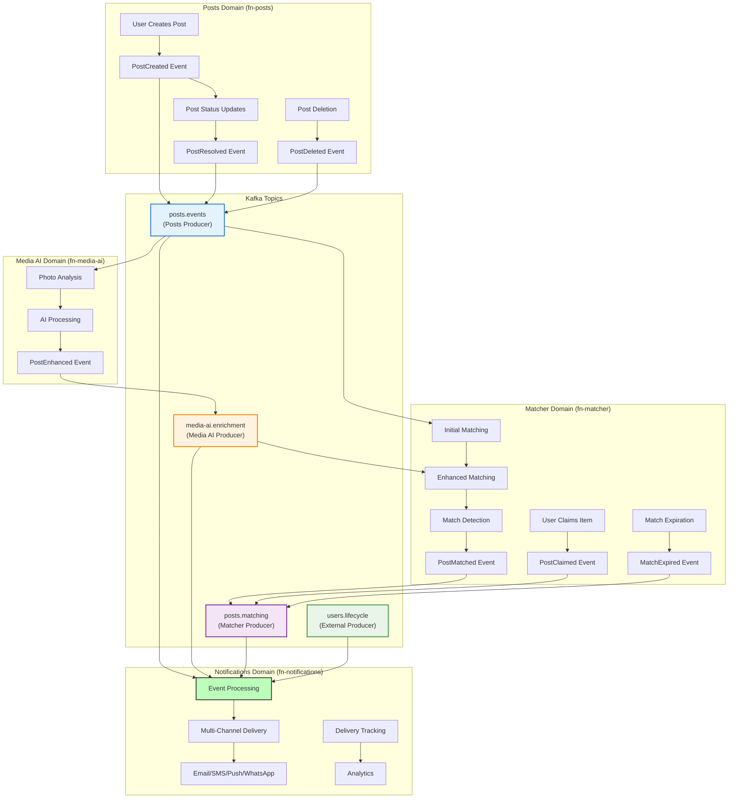

# Findly Now - System Architecture

**Document Ownership**: This document OWNS system boundaries, domain interactions, and high-level architectural decisions.

## Architectural Pattern

**Microservices with Domain-Driven Design (DDD)**
- Independent services aligned with business domain boundaries
- Event-driven communication for loose coupling
- Polyglot technology choices optimized per domain

## Domain Boundaries

### Posts Domain (`fn-posts`)
**Bounded Context**: Lost & Found item lifecycle management

**Responsibilities:**
- Photo-first post creation and validation (1-10 photos required)
- Geospatial search and proximity matching (PostGIS)
- Post status transitions (active → resolved/expired/deleted)
- Event publishing for all state changes

**Data Ownership:**
- Post entities with photo URLs
- Location coordinates and search radius
- Post metadata and status

### Notifications Domain (`fn-notifications`)
**Bounded Context**: Multi-channel notification delivery

**Responsibilities:**
- Event-driven notification processing from Posts domain
- Multi-channel delivery orchestration (Email, SMS, WhatsApp)
- User preference management and smart routing
- Real-time operational dashboard

**Data Ownership:**
- Notification entities and delivery status
- User preferences (email, phone, channel preferences)
- Delivery tracking and analytics

### Media AI Domain (`fn-media-ai`)
**Bounded Context**: AI-powered photo analysis and enrichment

**Responsibilities:**
- Computer vision analysis of photos from Posts domain
- Object recognition, scene detection, OCR processing
- AI-powered tag generation and attribute extraction
- Enhanced metadata generation with confidence scores

**Data Ownership:**
- AI analysis results and confidence scores
- Generated tags and extracted attributes
- Photo processing metadata

### Matcher Domain (`fn-matcher`)
**Bounded Context**: Intelligent matching between lost and found posts

**Responsibilities:**
- Multi-factor matching algorithm (location, visual, text, temporal)
- Match confidence scoring and quality assessment
- Match lifecycle management (pending → confirmed/rejected/expired)
- Item claiming workflow and verification
- Match statistics and analytics

**Data Ownership:**
- Match entities with confidence scores and reasons
- Claim records and verification status
- Cached post metadata for matching optimization
- Configurable matching rules and thresholds

### Contract Domain (`fn-contract`)
**Bounded Context**: API and event schema governance

**Responsibilities:**
- API contract definitions (OpenAPI)
- Event schema management (AsyncAPI)
- Schema versioning and compatibility validation
- Cross-domain contract enforcement

**Data Ownership:**
- API specifications and versions
- Event schemas and evolution rules
- Contract validation policies

## Inter-Domain Communication

### Event-Driven Architecture
**Primary Communication**: Confluent Cloud Kafka with Avro schemas

```
Posts Domain Events (Topic: posts.events):
├── post.created     → Notifications Domain (confirmation)
├── post.created     → Media AI Domain (photo analysis)
├── post.created     → Matcher Domain (initial matching)
├── post.updated     → Notifications Domain (status updates)
├── post.resolved    → Notifications Domain (success story)
└── post.deleted     → Notifications Domain (deletion confirmation)

Media AI Domain Events (Topic: media-ai.enrichment):
├── post.enhanced    → Posts Domain (enriched metadata)
└── post.enhanced    → Matcher Domain (improved matching)

Matcher Domain Events (Topic: posts.matching):
├── post.matched     → Notifications Domain (match alerts)
├── post.claimed     → Notifications Domain (urgent claim SMS)
├── match.expired    → Notifications Domain (expiration notice)
└── match.confirmed  → Notifications Domain (successful match)

User Domain Events (Topic: users.lifecycle):
├── user.registered       → Notifications Domain (welcome)
├── user.updated         → Notifications Domain (profile changes)
└── organization.staff_added → Notifications Domain (onboarding)
```

### Complete Event Flow Architecture



### Anti-Corruption Layers
Each domain protects its internal model from external changes:
- **EventTranslator** pattern converts external events to domain commands
- Domain events published in domain-specific schemas
- No direct API calls between domains (event-driven only)

## Technology Stack Overview

| Domain | Language | Database | Storage | Events |
|--------|----------|----------|---------|--------|
| Posts | Go | PostgreSQL + PostGIS | Google Cloud Storage | Kafka Producer |
| Notifications | Elixir/OTP | PostgreSQL | None | Kafka Consumer |
| Media AI | Python | None | Google Cloud Storage | Kafka Consumer/Producer |
| Matcher | Rust | PostgreSQL + PostGIS | None | Kafka Consumer/Producer |
| Contract | Multiple | Schema Registry | None | Schema Management |

## Infrastructure Boundaries

### Cloud Services
- **Google Cloud Platform**: Primary cloud provider
- **Confluent Cloud**: Managed Kafka for events
- **Supabase**: Managed PostgreSQL for Posts domain
- **Google Cloud Storage**: Photo storage with global CDN

### Deployment
- **Kubernetes (GKE)**: Container orchestration
- **Independent CI/CD**: Each service repository has separate pipelines
- **Environment Isolation**: Dev, staging, production with proper promotion

## Scalability Patterns

### Domain Independence
- **Horizontal Scaling**: Each domain scales independently
- **Technology Optimization**: Best language/framework per domain
- **Data Isolation**: No shared databases between domains
- **Fault Isolation**: Domain failures don't cascade

### Event Scalability
- **Parallel Processing**: Broadway consumers with configurable concurrency
- **Backpressure Handling**: Flow control when domains are overwhelmed
- **Event Replay**: Kafka retention allows reprocessing

## Security Boundaries

### Authentication
- **Service-to-Service**: JWT tokens for internal communication
- **External APIs**: OAuth2/OIDC with Google Identity
- **Event Security**: SASL authentication for Kafka

### Data Protection
- **Domain Isolation**: Each domain owns its data completely
- **Encryption**: All data encrypted at rest and in transit
- **PII Handling**: Contact info isolated in user preferences

## Integration Constraints

### Domain Rules
- **No Direct Database Access**: Domains never access other domains' databases
- **Event-Only Communication**: All inter-domain communication via events
- **Schema Evolution**: Backward compatibility required for all changes
- **Data Consistency**: Eventually consistent across domains

### Anti-Patterns to Avoid
- Shared databases between domains
- Synchronous API calls between domains
- Domain models leaking across boundaries
- Circular event dependencies

---

*For detailed business context, see [VISION.md](VISION.md). For implementation specifics, see individual service documentation.*