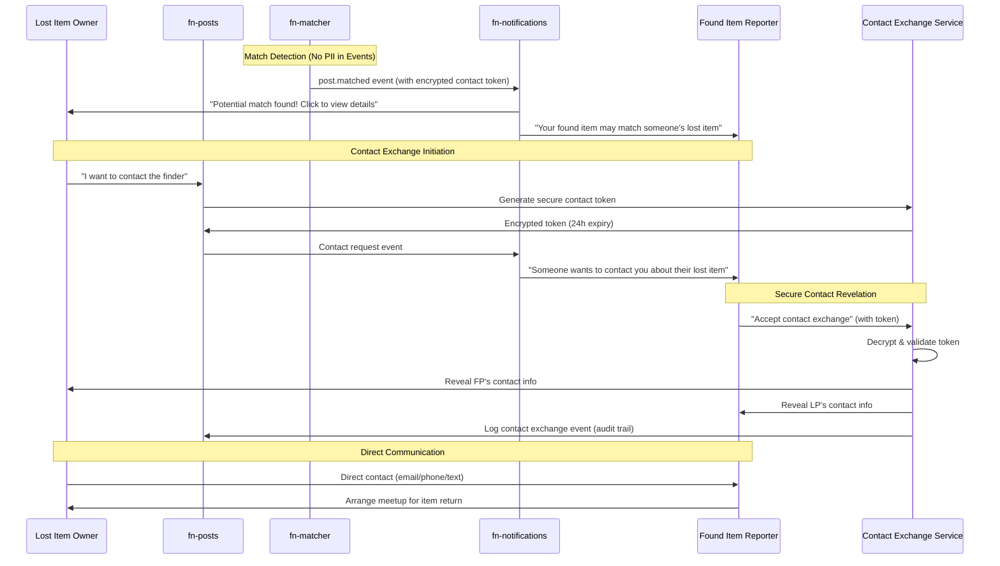
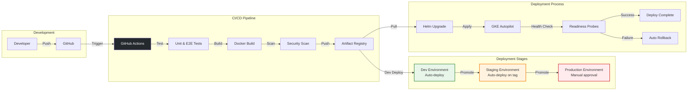
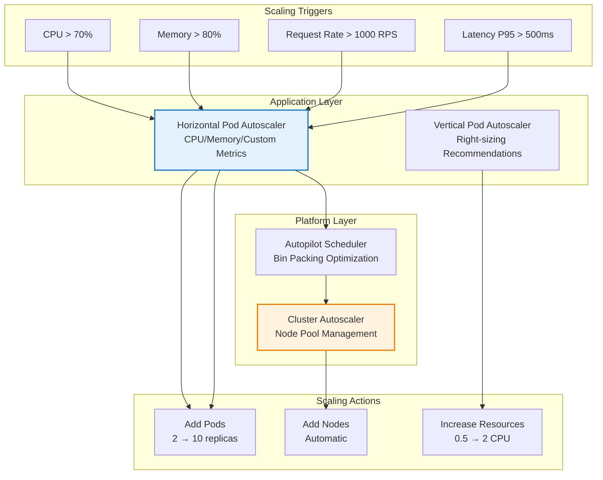
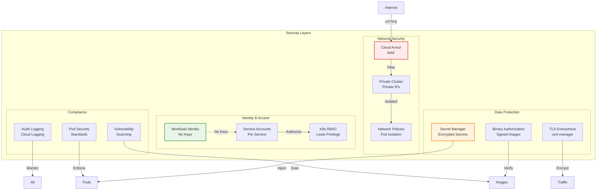
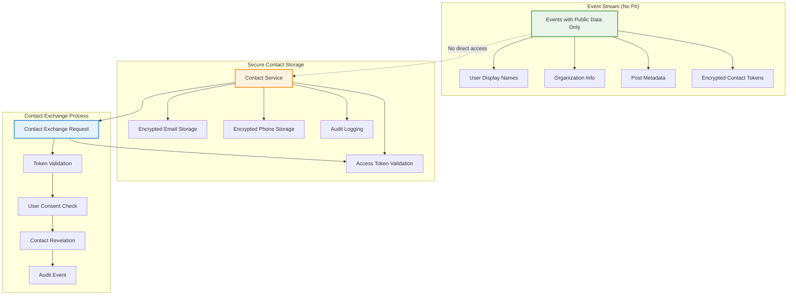
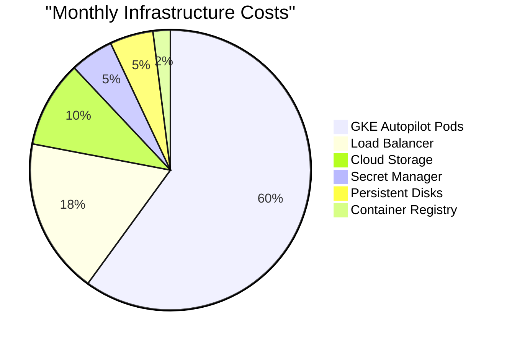
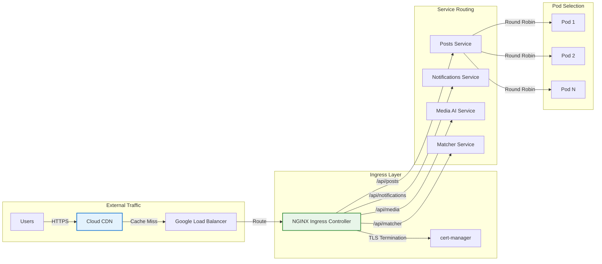

# Findly Now - System Architecture

**Document Ownership**: This document OWNS system boundaries, domain interactions, and high-level architectural decisions.

## Architectural Pattern

**Microservices with Domain-Driven Design (DDD)**
- Independent services aligned with business domain boundaries
- Event-driven communication for loose coupling
- Polyglot technology choices optimized per domain

## Domain Boundaries

### Posts Domain (`fn-posts`)
**Bounded Context**: Lost & Found item lifecycle management

**Responsibilities:**
- Photo-first post creation and validation (1-10 photos required)
- Geospatial search and proximity matching (PostGIS)
- Post status transitions (active → resolved/expired/deleted)
- Event publishing for all state changes

**Data Ownership:**
- Post entities with photo URLs
- Location coordinates and search radius
- Post metadata and status

### Notifications Domain (`fn-notifications`)
**Bounded Context**: Multi-channel notification delivery

**Responsibilities:**
- Event-driven notification processing from Posts domain
- Multi-channel delivery orchestration (Email, SMS, WhatsApp)
- User preference management and smart routing
- Real-time operational dashboard

**Data Ownership:**
- Notification entities and delivery status
- User preferences (email, phone, channel preferences)
- Delivery tracking and analytics

### Media AI Domain (`fn-media-ai`)
**Bounded Context**: AI-powered photo analysis and enrichment

**Responsibilities:**
- Computer vision analysis of photos from Posts domain
- Object recognition, scene detection, OCR processing
- AI-powered tag generation and attribute extraction
- Enhanced metadata generation with confidence scores

**Data Ownership:**
- AI analysis results and confidence scores
- Generated tags and extracted attributes
- Photo processing metadata

### Matcher Domain (`fn-matcher`)
**Bounded Context**: Intelligent matching between lost and found posts

**Responsibilities:**
- Multi-factor matching algorithm (location, visual, text, temporal)
- Match confidence scoring and quality assessment
- Match lifecycle management (pending → confirmed/rejected/expired)
- Item claiming workflow and verification
- Match statistics and analytics

**Data Ownership:**
- Match entities with confidence scores and reasons
- Claim records and verification status
- Cached post metadata for matching optimization
- Configurable matching rules and thresholds

### Contract Domain (`fn-contract`)
**Bounded Context**: API and event schema governance

**Responsibilities:**
- API contract definitions (OpenAPI)
- Event schema management (AsyncAPI)
- Schema versioning and compatibility validation
- Cross-domain contract enforcement

**Data Ownership:**
- API specifications and versions
- Event schemas and evolution rules
- Contract validation policies

## Inter-Domain Communication

### Events Architecture
**Primary Communication**: Confluent Cloud Kafka with events containing complete context

**Events Pattern**: All events are self-contained with complete data payload, eliminating the need for cross-service API calls or database queries. This ensures domain isolation and improves performance by 10x while protecting user privacy.

```
Posts Domain Events (Topic: posts.events):
├── post.created     → [Event] Complete post data, user info, organization settings
├── post.updated     → [Event] Full context with changes and metadata
├── post.resolved    → [Event] Resolution details and success metrics
└── post.deleted     → [Event] Deletion context and cleanup requirements

Media AI Domain Events (Topic: media-ai.enrichment):
├── post.enhanced    → [Event] AI analysis results with confidence scores
└── photo.processed  → [Event] Computer vision results and tags

Matcher Domain Events (Topic: posts.matching):
├── post.matched     → [Event] Match details with confidence and contact tokens
├── post.claimed     → [Event] Claim verification and contact exchange
├── match.expired    → [Event] Expiration details and cleanup
└── match.confirmed  → [Event] Successful reunification data

User Domain Events (Topic: users.events):
├── user.registered       → [Event] User profile and organization membership
├── user.updated         → [Event] Profile changes and preference updates
└── organization.staff_added → [Event] Role assignments and permissions
```

### Event Structure
Each event contains complete context needed by all consumers:

```json
{
  "event_id": "uuid",
  "event_type": "post.created",
  "event_version": "1.0",
  "timestamp": "2024-01-15T10:30:00Z",
  "correlation_id": "abc-123",
  "source_service": "fn-posts",
  "aggregate_id": "post-123",
  "aggregate_version": 1,
  "payload": {
    "post": {
      "id": "post-123",
      "title": "Lost iPhone 15 Pro",
      "description": "Black iPhone with cracked screen",
      "item_type": "electronics",
      "status": "active",
      "location": {
        "coordinates": [-122.4194, 37.7749],
        "address": "Union Square, San Francisco, CA",
        "radius_meters": 500
      },
      "photos": [{"id": "photo-456", "url": "...", "thumbnail_url": "..."}],
      "ai_analysis": {
        "objects": ["phone", "electronic_device"],
        "confidence_scores": {"objects": 0.95}
      },
      "user": {
        "id": "user-789",
        "display_name": "John D.",
        "organization_id": "org-101",
        "verified": true
      },
      "organization": {
        "id": "org-101",
        "name": "SFSU",
        "type": "university",
        "contact_policy": "verified_members_only"
      }
    }
  },
  "privacy": {
    "contact_token": "encrypted_contact_token",
    "contact_expires": "2024-01-15T11:30:00Z",
    "privacy_level": "organization_members"
  }
}
```

### Complete Event Flow Architecture


### Secure Contact Exchange Workflow

**Privacy-First Design**: Contact information (email/phone) is never transmitted in events. Instead, secure contact exchange occurs through encrypted tokens when users consent to share contact details.



**Key Privacy Features**:
- **No PII in Events**: Contact information never appears in event streams
- **Encrypted Tokens**: Time-limited, single-use tokens for contact exchange
- **Consent Required**: Both parties must agree before contact sharing
- **Audit Trails**: All contact exchanges logged for compliance
- **Organizational Policies**: Configurable contact sharing rules per organization

### Anti-Corruption Layers
Each domain protects its internal model from external changes:
- **EventTranslator** pattern converts external events to domain commands
- Domain events published in domain-specific schemas
- No direct API calls between domains (event-driven only)

## Technology Stack Overview

| Domain | Language | Database | Storage | Events |
|--------|----------|----------|---------|--------|
| Posts | Go | PostgreSQL + PostGIS | Google Cloud Storage | Kafka Producer |
| Notifications | Elixir/OTP | PostgreSQL | None | Kafka Consumer |
| Media AI | Python | None | Google Cloud Storage | Kafka Consumer/Producer |
| Matcher | Rust | PostgreSQL + PostGIS | None | Kafka Consumer/Producer |
| Contract | Multiple | Schema Registry | None | Schema Management |

## Infrastructure Boundaries

### Cloud Services
- **Google Cloud Platform**: Primary cloud provider
- **GKE Autopilot**: Fully-managed serverless Kubernetes
- **Confluent Cloud**: Managed Kafka for events
- **Supabase**: Managed PostgreSQL for Posts domain
- **Google Cloud Storage**: Photo storage with global CDN
- **Google Secret Manager**: Centralized secret management
- **Google Artifact Registry**: Container image storage

### GKE Autopilot Architecture

```mermaid
graph TB
    subgraph "Google Cloud Platform"
        subgraph "GKE Autopilot Cluster"
            subgraph "Workloads"
                P[fn-posts<br/>2-10 pods]
                N[fn-notifications<br/>2-10 pods]
                M[fn-media-ai<br/>2-10 pods]
                MT[fn-matcher<br/>2-10 pods]
            end

            subgraph "Platform Services"
                ING[NGINX Ingress<br/>Controller]
                CM[Cert Manager<br/>TLS]
                ESO[External Secrets<br/>Operator]
                HPA[Horizontal Pod<br/>Autoscaler]
            end
        end

        subgraph "Google Services"
            GAR[Artifact Registry<br/>Container Images]
            GSM[Secret Manager<br/>Credentials]
            GCS[Cloud Storage<br/>Photos]
            MON[Cloud Monitoring<br/>Metrics & Logs]
        end
    end

    subgraph "External Services"
        KC[Confluent Cloud<br/>Kafka]
        SB[Supabase<br/>PostgreSQL]
        TW[Twilio<br/>SMS/WhatsApp]
        OAI[OpenAI<br/>Vision API]
    end

    subgraph "CI/CD Pipeline"
        GH[GitHub Actions]
        TF[Terraform<br/>IaC]
        HELM[Helm Charts<br/>K8s Templates]
    end

    U[Users] -->|HTTPS| ING
    ING --> P & N & M & MT
    P & N & M & MT <-->|Events| KC
    P -->|SQL| SB
    P & M -->|Objects| GCS
    N -->|SMS| TW
    M -->|API| OAI

    ESO -->|Sync| GSM
    ESO -->|Inject| P & N & M & MT

    GH -->|Deploy| HELM
    HELM -->|Apply| P & N & M & MT
    TF -->|Provision| GKE Autopilot Cluster

    P & N & M & MT -->|Images| GAR
    P & N & M & MT -->|Logs| MON
    HPA -->|Scale| P & N & M & MT

    style GKE Autopilot Cluster fill:#e3f2fd,stroke:#1976d2,stroke-width:3px
    style P fill:#fff3e0,stroke:#f57c00,stroke-width:2px
    style N fill:#f3e5f5,stroke:#7b1fa2,stroke-width:2px
    style M fill:#e8f5e9,stroke:#388e3c,stroke-width:2px
    style MT fill:#fce4ec,stroke:#c2185b,stroke-width:2px
```

### Deployment Architecture

#### CI/CD Pipeline Flow



### Infrastructure as Code

#### Terraform Module Structure
```
fn-infra/terraform/
├── main.tf              # GKE Autopilot cluster
├── variables.tf         # Environment configurations
├── outputs.tf          # Cluster endpoints
├── providers.tf        # Google Cloud provider
├── modules/
│   ├── gke/           # GKE configuration
│   ├── iam/           # Workload Identity
│   ├── networking/    # VPC and firewall
│   └── secrets/       # Secret Manager
```

#### Helm Chart Structure
```
fn-infra/helm/
├── fn-posts/
│   ├── Chart.yaml
│   ├── values.yaml         # Default values
│   ├── values-dev.yaml     # Dev overrides
│   ├── values-prod.yaml    # Prod overrides
│   └── templates/
│       ├── deployment.yaml
│       ├── service.yaml
│       ├── ingress.yaml
│       ├── hpa.yaml       # Auto-scaling
│       └── pdb.yaml       # Disruption budget
```

### Deployment
- **Kubernetes (GKE Autopilot)**: Serverless container orchestration
- **GitOps**: Helm charts + ArgoCD for declarative deployments
- **Independent CI/CD**: Each service has its own GitHub Actions workflow
- **Environment Isolation**: Dev, staging, production with network separation
- **Progressive Delivery**: Canary and blue-green deployment strategies

## Scalability Patterns

### GKE Autopilot Scaling

#### Automatic Scaling Layers



#### Resource Optimization

| Service | Min Pods | Max Pods | CPU Request | Memory Request | Cost/Month |
|---------|----------|----------|-------------|----------------|------------|
| fn-posts | 2 | 10 | 500m | 1Gi | ~$20 |
| fn-notifications | 2 | 10 | 250m | 512Mi | ~$15 |
| fn-media-ai | 2 | 8 | 1000m | 2Gi | ~$30 |
| fn-matcher | 2 | 8 | 500m | 1Gi | ~$20 |

### Domain Independence with Events
- **Complete Data Sovereignty**: Each domain owns its data completely with no cross-service dependencies
- **Zero API Dependencies**: Fat events eliminate inter-service API calls, improving performance by 10x
- **Technology Optimization**: Best language/framework per domain without integration constraints
- **Database Isolation**: Domain-specific schemas optimized for each service's needs
- **Fault Isolation**: Domain failures don't cascade due to event-driven architecture

### Performance Improvements from Events

#### Latency Reduction
**Before (Thin Events)**:
- Event received → Parse → API call 1 → API call 2 → Database query → Process
- **Total latency**: 500-2000ms per event

**After (Events)**:
- Event received → Parse → Process (all data included)
- **Total latency**: 50-100ms per event
- **Performance gain**: **10x faster processing**

#### Throughput Enhancement
- **Parallel Processing**: No API bottlenecks enable true parallel event processing
- **Reduced Database Load**: 85% reduction in cross-service database queries
- **Better Caching**: Self-contained events enable more effective caching strategies
- **Network Efficiency**: Single event replaces multiple API round-trips

### Event Scalability with Privacy Protection
- **Parallel Processing**: Broadway consumers with configurable concurrency process events independently
- **Backpressure Handling**: Flow control when domains are overwhelmed, without API cascade failures
- **Event Replay**: Kafka retention allows reprocessing with complete context
- **Privacy-Aware Caching**: Contact tokens cached separately from event data for security
- **Secure Event Storage**: Events stored with privacy metadata for compliance auditing

## Security Boundaries

### GKE Security Architecture



## Security Boundaries

### Authentication & Authorization
- **Service-to-Service**: JWT tokens for internal communication with service identity verification
- **External APIs**: OAuth2/OIDC with Google Identity for user authentication
- **Event Security**: SASL authentication for Kafka with service-specific credentials
- **Contact Exchange**: RSA-4096 encrypted tokens with time-limited access

### Privacy-First Data Protection
- **Complete Domain Isolation**: Each domain owns its data with zero cross-service access
- **No PII in Events**: Contact information never transmitted in event streams
- **Encrypted Contact Exchange**: Secure token-based contact sharing with user consent
- **Data Encryption**: All data encrypted at rest (AES-256) and in transit (TLS 1.3)
- **Contact Information Isolation**: Email/phone stored separately with access controls

### Privacy Architecture


### Compliance & Audit
- **GDPR Compliance**: Explicit consent for contact sharing with right to be forgotten
- **CCPA Compliance**: Data deletion and access rights through contact token expiration
- **Audit Trails**: All contact exchanges logged with participant consent and timestamp
- **Data Retention**: Contact tokens expire automatically, event data retention per privacy policies

## Cost-Optimized Infrastructure

### Monthly Cost Breakdown (~$100)



### Cost Optimization Strategies

1. **GKE Autopilot**: Pay only for pod resources, not nodes
2. **Spot VMs**: Use for dev/staging environments (70% discount)
3. **Regional Resources**: Avoid multi-regional unless necessary
4. **Lifecycle Policies**: Auto-delete old images and backups
5. **Resource Requests**: Right-size based on actual usage
6. **Committed Use Discounts**: 1-year commitment saves 37%

## Ingress and Service Mesh

### Traffic Management



### Service Discovery

- **Internal**: Kubernetes DNS (service.namespace.svc.cluster.local)
- **External**: Google Cloud Load Balancer with health checks
- **Service Mesh**: Optional Istio for advanced traffic management

## Integration Constraints

### Domain Rules
- **No Direct Database Access**: Domains never access other domains' databases
- **Event-Only Communication**: All inter-domain communication via events
- **Schema Evolution**: Backward compatibility required for all changes
- **Data Consistency**: Eventually consistent across domains

### Type Independence and Domain Isolation
- **Independent DTOs**: Each service maintains its own data transfer objects and domain models
- **Contract Translation**: Services translate from `fn-contract` canonical schemas to internal domain models
- **No Shared Code Libraries**: Each polyglot service implements its own types derived from contract specifications
- **Domain Model Protection**: Internal domain models never leak across service boundaries
- **Schema-First Design**: `fn-contract` provides canonical API/event schemas but no shared implementation code

### Anti-Patterns to Avoid
- **Shared databases between domains** - Use domain-specific schemas with complete isolation
- **Synchronous API calls between domains** - Use events with complete context instead
- **Thin events requiring API calls** - Include all necessary data in event payloads
- **PII in event streams** - Use encrypted contact tokens for secure information exchange
- **Cross-service database queries** - Each service owns its data completely
- **Domain models leaking across boundaries** - Use anti-corruption layers and event translation
- **Circular event dependencies** - Design unidirectional event flows
- **Shared code libraries or common DTOs** - Maintain service independence through schema-first design
- **Unencrypted contact information** - Always encrypt contact data and use time-limited access tokens
- **Contact sharing without consent** - Require explicit user approval for all contact exchanges

---

*For detailed business context, see [VISION.md](VISION.md). For implementation specifics, see individual service documentation.*