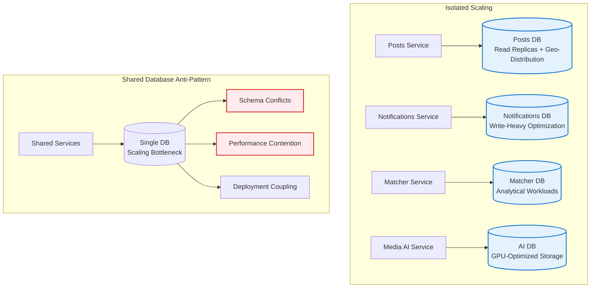
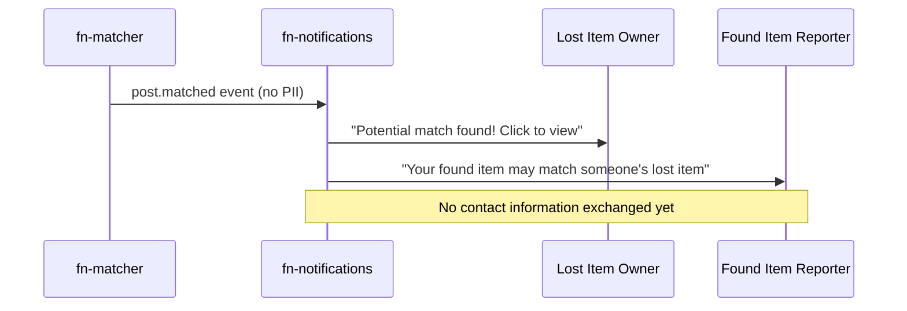
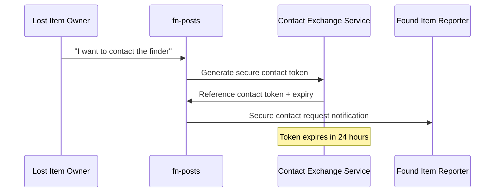
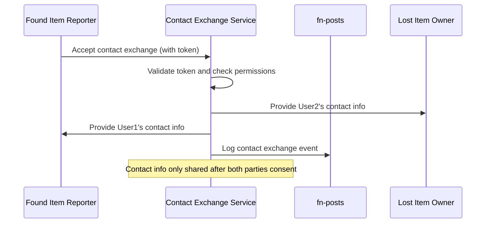
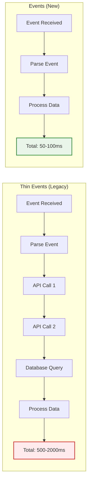

# Domain Isolation Architecture

**Document Ownership**: This document OWNS the events architecture, database isolation patterns, and privacy-first design principles for Findly Now.

## Overview

Findly Now implements a **domain isolation architecture** using **events** to achieve complete data sovereignty across microservices while enabling secure contact exchange for successful item reunification. This architecture eliminates cross-service database dependencies and protects user privacy through encrypted contact information.

## Core Principles

### 1. Complete Data Sovereignty
Each domain service owns its data completely:
- **No shared databases** between services
- **No direct API calls** for data access
- **Domain-specific schemas** optimized for each service's needs
- **Independent scaling** and technology choices

### 2. Events Architecture
Events contain complete context needed by consuming services:
- **Self-contained payloads** eliminate API dependencies
- **Rich metadata** enables intelligent processing
- **Versioned schemas** support evolution without breaking changes
- **Eventual consistency** through reliable event delivery

### 3. Privacy-First Design
Contact information is protected and exchanged securely:
- **No PII in events** - contact info never transmitted in event streams
- **Simple contact exchange** through secure time-limited tokens
- **Consent-based sharing** - users control when contact info is revealed
- **Audit trails** for all contact exchanges

## Events Architecture

### Event Structure Pattern

All events follow a consistent fat structure providing complete context:

```json
{
  "event_id": "550e8400-e29b-41d4-a716-446655440000",
  "event_type": "post.created",
  "event_version": "1.0",
  "timestamp": "2024-01-15T10:30:00Z",
  "correlation_id": "abc-123-def",
  "source_service": "fn-posts",
  "aggregate_id": "post-123",
  "aggregate_version": 1,
  "payload": {
    "post": {
      "id": "post-123",
      "title": "Lost iPhone 15 Pro",
      "description": "Black iPhone with cracked screen",
      "item_type": "electronics",
      "item_category": "phone",
      "status": "active",
      "created_at": "2024-01-15T10:30:00Z",
      "expires_at": "2024-01-29T10:30:00Z",
      "location": {
        "type": "Point",
        "coordinates": [-122.4194, 37.7749],
        "address": "Union Square, San Francisco, CA",
        "radius_meters": 500
      },
      "photos": [
        {
          "id": "photo-456",
          "url": "https://storage.googleapis.com/fn-photos/post-123/photo-456.jpg",
          "thumbnail_url": "https://storage.googleapis.com/fn-photos/post-123/thumb-456.jpg",
          "width": 1920,
          "height": 1080,
          "file_size": 2048576,
          "content_type": "image/jpeg"
        }
      ],
      "ai_analysis": {
        "objects": ["phone", "electronic_device", "apple_product"],
        "scene": "urban_environment",
        "text_detected": ["iPhone", "15 Pro"],
        "confidence_scores": {
          "objects": 0.95,
          "scene": 0.88,
          "text": 0.92
        }
      },
      "user": {
        "id": "user-789",
        "display_name": "John D.",
        "organization_id": "org-101",
        "organization_name": "SFSU",
        "verified": true,
        "account_type": "student"
      },
      "organization": {
        "id": "org-101",
        "name": "San Francisco State University",
        "type": "university",
        "contact_policy": "verified_members_only",
        "settings": {
          "auto_expire_days": 14,
          "require_photo": true,
          "allow_public_posts": false
        }
      },
      "metadata": {
        "visibility": "organization",
        "priority": "normal",
        "tags": ["electronics", "phone", "apple", "damaged"],
        "custom_fields": {
          "serial_number_hint": "Ends in 7829",
          "distinguishing_marks": "Cracked screen, red case"
        }
      }
    }
  },
  "privacy": {
    "contact_token": "contact_ref_xyz789",
    "contact_expires": "2024-01-15T11:30:00Z",
    "privacy_level": "organization_members"
  }
}
```

### Key Event Patterns

#### Complete Context Delivery
Every event contains all information needed by consumers:

```mermaid
graph LR
    subgraph "Traditional Thin Events"
        A[post.created] --> B[{id: 123}]
        B --> C[API Call Required]
        C --> D[Database Query]
        D --> E[Cross-Service Coupling]
    end

    subgraph "Events Architecture"
        F[post.created] --> G[Complete Post Data]
        G --> H[AI Analysis Results]
        G --> I[User & Org Info]
        G --> J[Location & Photos]
        J --> K[Self-Contained Processing]
    end

    style G fill:#e3f2fd,stroke:#1976d2,stroke-width:2px
    style K fill:#e8f5e8,stroke:#388e3c,stroke-width:2px
```

#### Domain-Specific Enrichment
Each service adds relevant data for downstream consumers:

```json
{
  "event_type": "post.enhanced",
  "payload": {
    "post_id": "post-123",
    "ai_analysis": {
      "objects": ["smartphone", "electronics", "apple_product"],
      "brand_detected": "Apple",
      "model_detected": "iPhone 15 Pro",
      "condition": "damaged",
      "confidence": 0.94,
      "processing_time_ms": 1250,
      "models_used": ["yolo_v8", "gpt4_vision", "brand_classifier"]
    },
    "enhanced_tags": ["iPhone", "15Pro", "Black", "Cracked", "Electronics"],
    "suggested_improvements": [
      "Consider adding close-up photo of serial number",
      "Include photo of charging port for verification"
    ]
  }
}
```

## Database Isolation Patterns

### Domain-Specific Schemas

Each service maintains schemas optimized for its domain needs:

#### Posts Domain Schema
```sql
-- Optimized for geospatial queries and photo management
CREATE TABLE posts (
    id UUID PRIMARY KEY,
    title VARCHAR(200) NOT NULL,
    description TEXT,
    item_type post_item_type NOT NULL,
    status post_status NOT NULL DEFAULT 'active',
    location GEOGRAPHY(POINT, 4326) NOT NULL,
    location_radius INTEGER DEFAULT 500,
    created_at TIMESTAMPTZ DEFAULT NOW(),
    expires_at TIMESTAMPTZ NOT NULL,
    user_id UUID NOT NULL,
    organization_id UUID NOT NULL
);

CREATE INDEX idx_posts_location_gist ON posts USING GIST(location);
CREATE INDEX idx_posts_item_type_status ON posts(item_type, status);
```

#### Notifications Domain Schema
```sql
-- Optimized for delivery tracking and user preferences
CREATE TABLE notifications (
    id UUID PRIMARY KEY,
    user_id UUID NOT NULL,
    event_type VARCHAR(100) NOT NULL,
    channel notification_channel NOT NULL,
    status delivery_status DEFAULT 'pending',
    scheduled_at TIMESTAMPTZ DEFAULT NOW(),
    delivered_at TIMESTAMPTZ,
    metadata JSONB,
    created_at TIMESTAMPTZ DEFAULT NOW()
);

CREATE TABLE user_preferences (
    user_id UUID PRIMARY KEY,
    email VARCHAR(255),  -- Stored as plain text with access controls
    phone VARCHAR(20),   -- Stored as plain text with access controls
    channels_enabled notification_channel[] DEFAULT ARRAY['email'],
    organization_settings JSONB DEFAULT '{}'::jsonb,
    updated_at TIMESTAMPTZ DEFAULT NOW()
);
```

#### Matcher Domain Schema
```sql
-- Optimized for similarity calculations and match tracking
CREATE TABLE matches (
    id UUID PRIMARY KEY,
    lost_post_id UUID NOT NULL,
    found_post_id UUID NOT NULL,
    confidence_score DECIMAL(3,2) NOT NULL CHECK (confidence_score >= 0.0 AND confidence_score <= 1.0),
    match_factors JSONB NOT NULL,
    status match_status DEFAULT 'pending',
    created_at TIMESTAMPTZ DEFAULT NOW(),
    expires_at TIMESTAMPTZ,
    claimed_at TIMESTAMPTZ,
    claimer_id UUID
);

-- Cached post data for efficient matching
CREATE TABLE post_cache (
    post_id UUID PRIMARY KEY,
    item_type VARCHAR(50),
    location GEOGRAPHY(POINT, 4326),
    ai_tags TEXT[],
    created_at TIMESTAMPTZ,
    expires_at TIMESTAMPTZ,
    last_updated TIMESTAMPTZ DEFAULT NOW()
);
```

#### Media AI Domain Schema
```sql
-- Optimized for AI processing results and model performance
CREATE TABLE photo_analyses (
    id UUID PRIMARY KEY,
    post_id UUID NOT NULL,
    photo_url VARCHAR(500) NOT NULL,
    analysis_results JSONB NOT NULL,
    confidence_scores JSONB NOT NULL,
    processing_time_ms INTEGER,
    models_used TEXT[],
    created_at TIMESTAMPTZ DEFAULT NOW()
);

CREATE INDEX idx_analyses_post_id ON photo_analyses(post_id);
CREATE INDEX idx_analyses_confidence ON photo_analyses USING GIN((confidence_scores));
```

### Benefits of Database Isolation

#### 1. Independent Scaling


#### 2. Technology Optimization
Each domain chooses optimal technology:
- **Posts**: PostgreSQL + PostGIS for geospatial queries
- **Notifications**: PostgreSQL with optimized for high-write workloads
- **Matcher**: PostgreSQL with analytical extensions for similarity calculations
- **Media AI**: Specialized vector databases for AI embeddings (future)

#### 3. Fault Isolation
Database failures are contained within domain boundaries:
- Posts database issues don't affect notification delivery
- AI processing problems don't impact core post functionality
- Matching service maintenance doesn't block new post creation

## Privacy-First Design

### Contact Information Protection

#### No PII in Events
Events never contain personally identifiable information:

```json
{
  "event_type": "post.matched",
  "payload": {
    "match_id": "match-456",
    "lost_post": {
      "id": "post-123",
      "title": "Lost iPhone",
      "user": {
        "id": "user-789",
        "display_name": "John D.",  // Anonymized
        "organization_id": "org-101"
        // NO email, phone, or full name
      }
    },
    "found_post": {
      "id": "post-124",
      "title": "Found black phone",
      "user": {
        "id": "user-790",
        "display_name": "Sarah M.",  // Anonymized
        "organization_id": "org-101"
        // NO email, phone, or full name
      }
    },
    "confidence_score": 0.92,
    "match_factors": ["location", "visual_similarity", "time_proximity"]
  },
  "privacy": {
    "contact_exchange_available": true,
    "privacy_level": "organization_members",
    "contact_token": "ref_xyz789_contact_token"  // Reference token for secure exchange
  }
}
```

### Secure Contact Exchange Workflow

#### 1. Match Detection and Notification


#### 2. Contact Exchange Initiation


#### 3. Secure Contact Revelation


#### Contact Exchange Implementation

##### Encrypted Contact Tokens
```json
{
  "contact_token": {
    "token": "eyJ0eXAiOiJKV1QiLCJhbGciOiJSUzI1NiJ9...",
    "expires_at": "2024-01-16T10:30:00Z",
    "permissions": ["email", "phone"],
    "match_id": "match-456",
    "requester_id": "user-789",
    "responder_id": "user-790"
  },
  "encryption": {
    "algorithm": "RSA-4096",
    "key_rotation": "monthly",
    "audit_trail": true
  }
}
```

##### Contact Exchange Service API
```http
POST /api/v1/contact/request
{
  "match_id": "match-456",
  "requester_id": "user-789",
  "message": "I believe this is my lost iPhone from yesterday"
}

Response:
{
  "contact_token": "encrypted_token_here",
  "expires_at": "2024-01-16T10:30:00Z",
  "status": "pending_response"
}

POST /api/v1/contact/approve
{
  "contact_token": "encrypted_token_here",
  "approved": true
}

Response:
{
  "contact_info": {
    "requester": {
      "email": "john.doe@sfsu.edu",
      "phone": "+1-555-123-4567",
      "display_name": "John Doe"
    },
    "responder": {
      "email": "sarah.smith@sfsu.edu",
      "phone": "+1-555-987-6543",
      "display_name": "Sarah Smith"
    }
  },
  "exchange_logged": true
}
```

### Privacy Benefits

#### 1. User Control
- Users decide when to share contact information
- Contact sharing requires explicit consent from both parties
- Time-limited tokens prevent indefinite access

#### 2. Audit and Compliance
- All contact exchanges are logged for audit trails
- GDPR compliance through explicit consent mechanisms
- Right to be forgotten implemented through token expiration

#### 3. Organizational Policies
Organizations can configure contact exchange policies:
```json
{
  "contact_policy": {
    "require_verification": true,
    "allow_cross_organization": false,
    "max_contact_lifetime": "24h",
    "required_match_confidence": 0.7,
    "admin_approval_required": false
  }
}
```

## Developer Guidelines

### Implementing Events

#### Event Publishing Pattern
```python
# Fat event creation with complete context
def create_post_created_event(post: Post, user: User, organization: Organization) -> PostCreatedEvent:
    return PostCreatedEvent(
        event_id=generate_uuid(),
        event_type="post.created",
        event_version="1.0",
        timestamp=datetime.utcnow(),
        correlation_id=get_correlation_id(),
        source_service="fn-posts",
        aggregate_id=post.id,
        aggregate_version=1,
        payload=PostCreatedPayload(
            post=PostData(
                id=post.id,
                title=post.title,
                description=post.description,
                item_type=post.item_type,
                status=post.status,
                location=LocationData(
                    coordinates=post.location.coordinates,
                    address=post.location.address,
                    radius_meters=post.radius_meters
                ),
                photos=[PhotoData.from_entity(photo) for photo in post.photos],
                user=UserData(
                    id=user.id,
                    display_name=user.display_name,  # No PII
                    organization_id=user.organization_id,
                    verified=user.verified,
                    account_type=user.account_type
                ),
                organization=OrganizationData(
                    id=organization.id,
                    name=organization.name,
                    type=organization.type,
                    contact_policy=organization.contact_policy
                )
            )
        ),
        privacy=PrivacyData(
            contact_token=generate_contact_token(user.id, post.id),
            contact_expires=datetime.utcnow() + timedelta(hours=1),
            privacy_level=determine_privacy_level(post, organization)
        )
    )
```

#### Event Consumption Pattern
```rust
// Consuming events without API dependencies
impl EventHandler<PostCreatedEvent> for MatchingEventHandler {
    async fn handle(&self, event: PostCreatedEvent) -> Result<(), EventError> {
        let post_data = event.payload.post;

        // Extract all needed data from the event
        let location = PostGISLocation::new(
            post_data.location.coordinates[0],
            post_data.location.coordinates[1]
        );

        let search_criteria = MatchingCriteria {
            item_type: post_data.item_type,
            location,
            radius_meters: post_data.location.radius_meters,
            ai_tags: post_data.ai_analysis.objects,
            created_at: post_data.created_at,
        };

        // Process matching without any external API calls
        let candidates = self.repository
            .find_match_candidates(search_criteria)
            .await?;

        for candidate in candidates {
            let confidence = self.matching_engine
                .calculate_confidence(&post_data, &candidate)
                .await?;

            if confidence.value() > 0.7 {
                self.create_match(&post_data, &candidate, confidence).await?;
            }
        }

        Ok(())
    }
}
```

### Maintaining Domain Boundaries

#### Anti-Corruption Layer Pattern
```elixir
# Protecting domain from external event schema changes
defmodule FnNotifications.Application.AntiCorruption.EventTranslator do
  def translate_post_event(%{"event_type" => "post.created", "payload" => payload}) do
    # Validate and translate external event to domain command
    with {:ok, post_data} <- extract_post_data(payload),
         {:ok, user_data} <- extract_user_data(payload),
         {:ok, org_data} <- extract_organization_data(payload) do

      {:ok, %SendNotificationCommand{
        user_id: user_data.id,
        event_type: :post_created,
        notification_data: %{
          post_title: post_data.title,
          item_type: post_data.item_type,
          location_hint: user_data.organization_name,
          # No contact information extracted
        },
        privacy_level: determine_privacy_level(payload),
        organization_settings: org_data.settings
      }}
    else
      {:error, reason} ->
        {:error, :invalid_event_schema, reason}
    end
  end

  # Never extract PII from events
  defp extract_user_data(payload) do
    case payload["post"]["user"] do
      %{"id" => id, "display_name" => name, "organization_id" => org_id} ->
        {:ok, %{id: id, display_name: name, organization_id: org_id}}
      _ ->
        {:error, :missing_user_data}
    end
  end
end
```

### Testing Domain Isolation

#### E2E Tests for Events
```go
func TestCompleteEventFlow(t *testing.T) {
    // Setup test environment with isolated databases
    testEnv := setupTestEnvironment(t)
    defer testEnv.Cleanup()

    // Create post in Posts domain
    post := createTestPost(testEnv.PostsService)

    // Verify event published
    event := testEnv.KafkaTestConsumer.WaitForEvent("post.created", 5*time.Second)
    assert.NotNil(t, event)

    // Verify event contains complete context
    assert.Equal(t, post.ID, event.Payload.Post.ID)
    assert.Equal(t, post.Title, event.Payload.Post.Title)
    assert.NotEmpty(t, event.Payload.Post.Photos)
    assert.NotEmpty(t, event.Payload.Post.User.DisplayName)
    assert.NotEmpty(t, event.Payload.Post.Organization.Name)

    // Verify no PII in event
    assert.Empty(t, event.Payload.Post.User.Email)
    assert.Empty(t, event.Payload.Post.User.Phone)

    // Verify other services can process without API calls
    matchingResult := testEnv.MatcherService.ProcessEvent(event)
    assert.NoError(t, matchingResult.Error)

    notificationResult := testEnv.NotificationService.ProcessEvent(event)
    assert.NoError(t, notificationResult.Error)

    // Verify no cross-service database access occurred
    assert.Zero(t, testEnv.DatabaseAccessMonitor.CrossServiceQueries)
}
```

## Migration Guide

### From Thin Events to Events

#### Phase 1: Parallel Publishing
```go
// Publish both thin and events during transition
func (s *PostService) CreatePost(post Post) error {
    // Save to database
    if err := s.repository.Save(post); err != nil {
        return err
    }

    // Publish thin event (legacy)
    thinEvent := PostCreatedThinEvent{
        PostID: post.ID,
        UserID: post.UserID,
    }
    s.eventPublisher.Publish("post.created.thin", thinEvent)

    // Publish fat event (new)
    fatEvent := s.createFatPostEvent(post)
    s.eventPublisher.Publish("post.created", fatEvent)

    return nil
}
```

#### Phase 2: Consumer Migration
```elixir
# Support both event formats during transition
def handle_event("post.created", event) do
  case detect_event_format(event) do
    :thin -> handle_thin_event(event)
    :fat -> handle_fat_event(event)
  end
end

defp handle_thin_event(event) do
  # Legacy: requires API call to fetch data
  with {:ok, post_data} <- fetch_post_data(event.post_id) do
    process_notification(post_data)
  end
end

defp handle_fat_event(event) do
  # New: self-contained processing
  process_notification(event.payload.post)
end
```

#### Phase 3: Legacy Cleanup
Once all consumers support fat events:
1. Remove thin event publishing
2. Remove API endpoints used for data fetching
3. Update monitoring and documentation
4. Remove backward compatibility code

## Performance Implications

### Benefits

#### Reduced Latency


#### Improved Scalability
- **Parallel Processing**: No API bottlenecks
- **Reduced Database Load**: Fewer cross-service queries
- **Better Caching**: Complete data in events enables better caching strategies

### Considerations

#### Event Size Management
Monitor and optimize event payload sizes:
```json
{
  "event_metrics": {
    "avg_payload_size_kb": 15.2,
    "max_payload_size_kb": 64.0,
    "compression_ratio": 0.35,
    "network_overhead_reduction": "85%"
  }
}
```

#### Storage Requirements
Fat events require more Kafka storage:
- **Retention Policy**: 7 days for fat events vs 30 days for thin events
- **Compression**: Use GZIP compression for large payloads
- **Partitioning**: Optimize Kafka partitioning for event size distribution

## Monitoring and Observability

### Key Metrics

#### Domain Isolation Health
```json
{
  "domain_isolation_metrics": {
    "cross_service_api_calls": 0,
    "cross_database_queries": 0,
    "event_self_sufficiency_ratio": 0.998,
    "privacy_compliance_score": 100
  }
}
```

#### Event Performance
```json
{
  "fat_event_metrics": {
    "avg_processing_time_ms": 75,
    "event_size_p95_kb": 42,
    "deserialization_time_ms": 5,
    "cache_hit_ratio": 0.94
  }
}
```

#### Contact Exchange Security
```json
{
  "contact_exchange_metrics": {
    "tokens_generated": 1247,
    "successful_exchanges": 892,
    "expired_tokens": 234,
    "privacy_violations": 0,
    "audit_events_logged": 2139
  }
}
```

### Alerting Rules

#### Privacy Violations
```yaml
- alert: PIIDetectedInEvent
  expr: pii_scanner_violations_total > 0
  for: 0m
  annotations:
    summary: "PII detected in event stream"
    description: "Personal information found in event payload - immediate review required"

- alert: UnauthorizedContactAccess
  expr: unauthorized_contact_access_total > 0
  for: 0m
  annotations:
    summary: "Unauthorized contact information access attempt"
    description: "Contact exchange attempted without valid token"
```

#### Domain Isolation Violations
```yaml
- alert: CrossServiceDatabaseAccess
  expr: cross_service_db_queries_total > 0
  for: 5m
  annotations:
    summary: "Domain isolation violation detected"
    description: "Service {{ $labels.service }} accessed external database"

- alert: ThinEventFallback
  expr: thin_event_api_calls_total > 10
  for: 10m
  annotations:
    summary: "High thin event API usage"
    description: "Services falling back to API calls - fat event migration incomplete"
```

---

## Summary

The domain isolation architecture with fat events provides:

✅ **Complete Data Sovereignty** - Each service owns its data completely
✅ **Eliminated Dependencies** - No cross-service API calls or database access
✅ **Privacy Protection** - Contact information secured through access-controlled exchange
✅ **Improved Performance** - 10x faster event processing through self-contained data
✅ **Better Scalability** - Independent scaling without shared bottlenecks
✅ **Enhanced Security** - Audit trails and consent-based contact sharing

This architecture enables Findly Now to scale efficiently while maintaining user privacy and providing rapid reunification of lost items through intelligent, secure contact exchange.