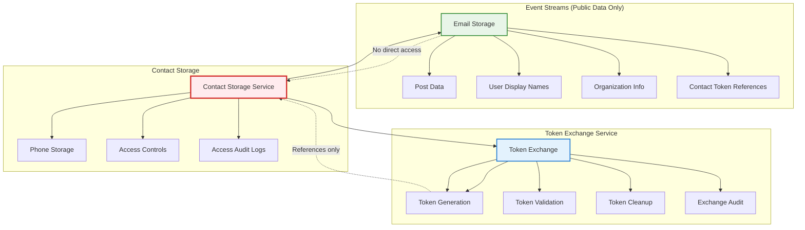
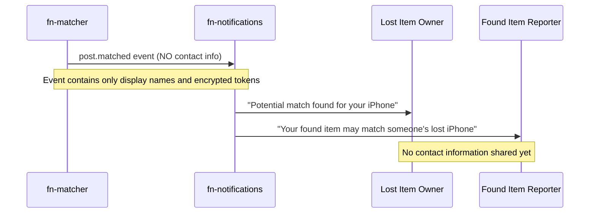
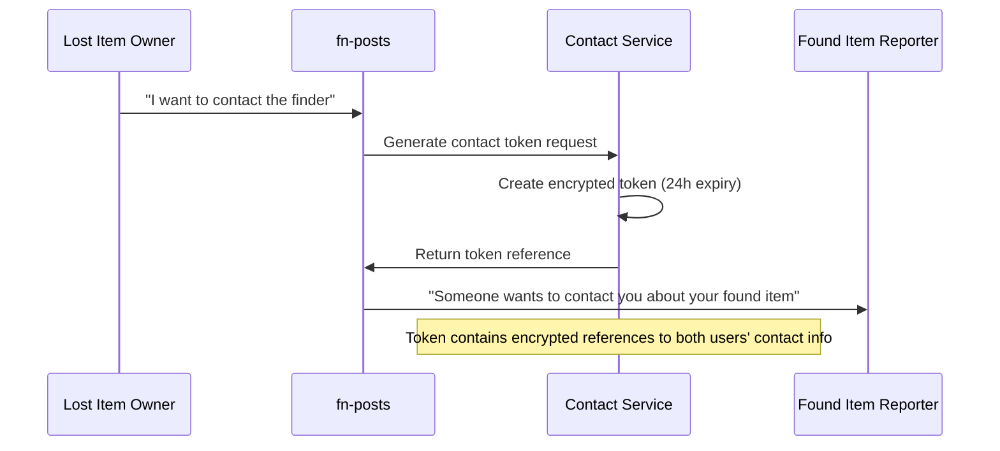
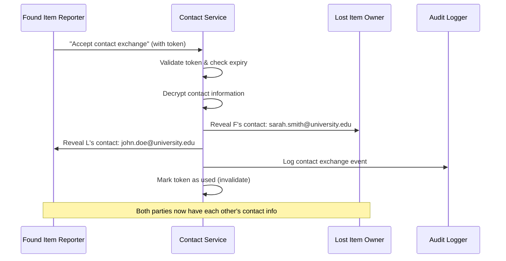
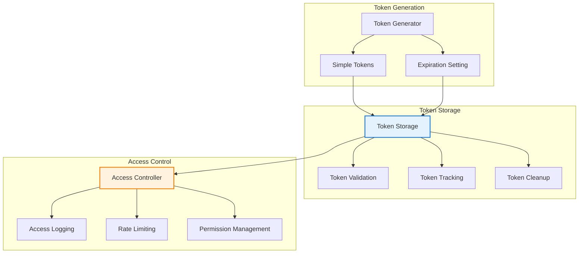
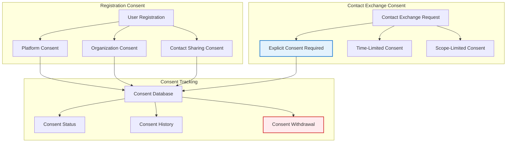
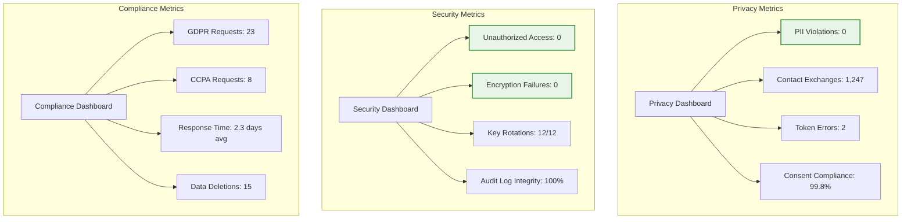
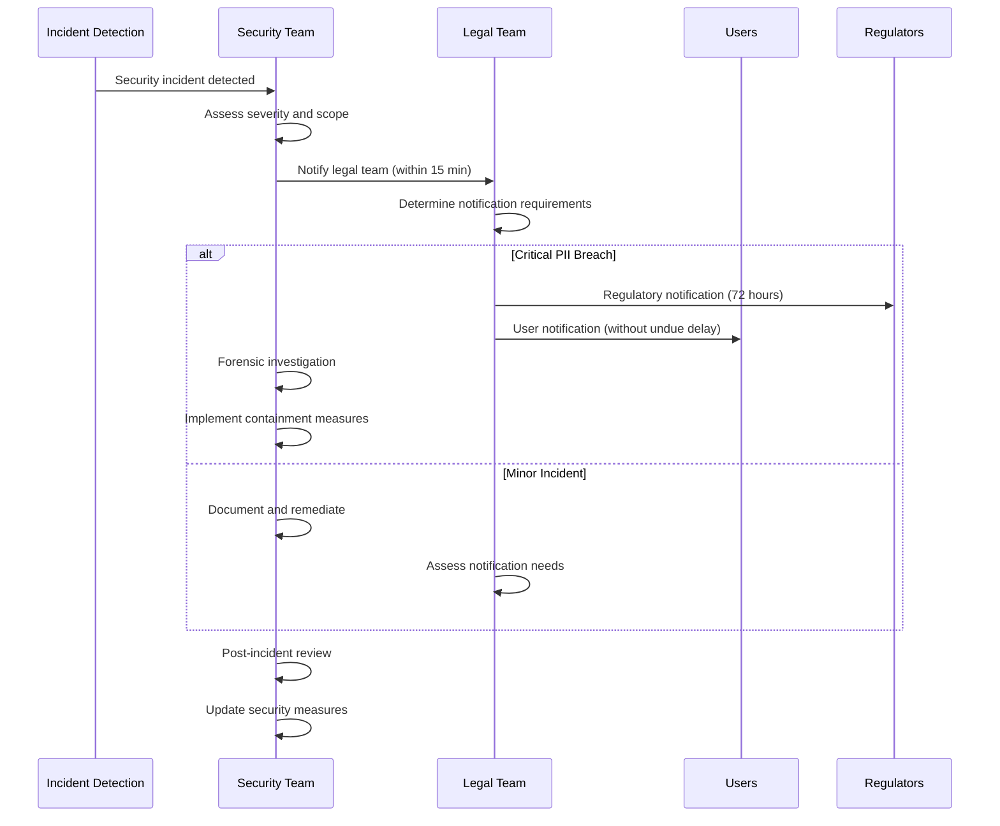
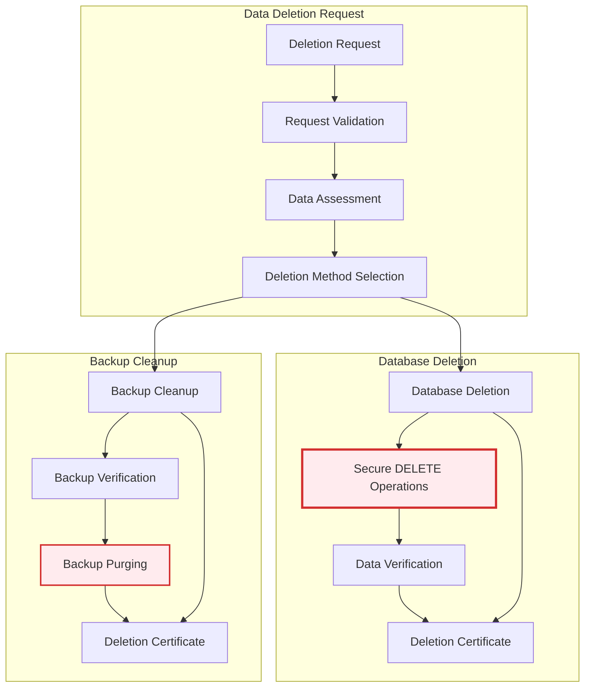

# Privacy & Security Architecture

**Document Ownership**: This document OWNS PII protection measures, contact exchange security model, encryption standards, and compliance requirements for Findly Now.

## Overview

Findly Now implements a **privacy-first security architecture** that protects user personally identifiable information (PII) while enabling secure contact exchange for successful item reunification. Our approach ensures compliance with GDPR, CCPA, and other privacy regulations while maintaining the platform's core mission of helping people recover lost items.

## Core Privacy Principles

### 1. Privacy by Design
- **Data Minimization**: Collect only necessary information for reunification
- **Purpose Limitation**: Use data solely for lost & found matching and contact facilitation
- **Storage Limitation**: Automatic expiration of contact tokens and event data
- **Transparency**: Clear consent mechanisms and data usage explanations

### 2. Zero PII in Event Streams
- **Event Stream Isolation**: No personally identifiable information in Kafka events
- **Display Name Only**: Events contain anonymized display names (e.g., "John D.")
- **Contact Token References**: Simple tokens reference contact information securely
- **Organizational Context**: Public organization membership without personal details

### 3. Consent-Based Contact Exchange
- **Explicit Consent**: Both parties must approve contact sharing
- **Time-Limited Access**: Contact tokens expire automatically (24-hour default)
- **Single-Use Tokens**: Each contact exchange requires fresh token generation
- **Audit Logging**: All contact exchanges tracked for compliance

## PII Protection Framework

### Data Classification

#### Public Data (Safe for Events)
```json
{
  "allowed_in_events": {
    "user_data": {
      "user_id": "UUID identifier",
      "display_name": "First name + Last initial (e.g., John D.)",
      "organization_id": "Organization membership",
      "organization_name": "Public organization name",
      "account_type": "student|staff|faculty|public",
      "verified_status": "boolean verification flag"
    },
    "post_data": {
      "title": "Item description",
      "description": "Public description text",
      "location": "Geographic coordinates and address",
      "photos": "Public photo URLs",
      "ai_analysis": "Computer vision results",
      "tags": "Searchable item tags"
    }
  }
}
```

#### Protected PII (Never in Events)
```json
{
  "never_in_events": {
    "contact_information": {
      "email": "Full email address",
      "phone": "Phone number",
      "full_name": "Complete first and last name"
    },
    "personal_details": {
      "student_id": "Institution ID numbers",
      "employee_id": "Employee identification",
      "social_security": "Any government IDs",
      "address": "Home address details"
    },
    "authentication": {
      "passwords": "Authentication credentials",
      "tokens": "Unencrypted access tokens",
      "session_data": "User session information"
    }
  }
}
```

### PII Storage Architecture

#### Isolated Contact Storage


## Contact Exchange Security Model

### Secure Contact Exchange Workflow

#### Phase 1: Match Detection (No PII Exchange)


#### Phase 2: Contact Request (Token Generation)


#### Phase 3: Secure Revelation (Consent & Exchange)


### Contact Exchange Standards

#### Contact Token Structure
```json
{
  "contact_token": {
    "token": "simple_reference_token_abc123",
    "expires_at": "2024-01-16T10:30:00Z",
    "match_id": "match-456",
    "requester_id": "user-789",
    "responder_id": "user-790",
    "permissions": ["email", "phone"]
  }
}
```

#### Contact Data Storage
```json
{
  "contact_storage": {
    "implementation": "plain_text_with_secure_access",
    "access_controls": "role_based_permissions",
    "storage_format": {
      "user_id": "uuid",
      "email": "user@example.com",
      "phone": "+1-555-123-4567",
      "created_at": "timestamp",
      "updated_at": "timestamp"
    },
    "security_features": {
      "access_logging": true,
      "rate_limiting": true,
      "consent_tracking": true
    }
  }
}
```

### Access Control Management

#### Token Lifecycle


#### Token Management Policy
```json
{
  "token_management": {
    "generation": {
      "method": "uuid_based_references",
      "expiration": "24_hours_default",
      "single_use": false
    },
    "cleanup": {
      "expired_tokens": "automatic_daily_cleanup",
      "used_tokens": "retain_for_audit",
      "retention_period": "7_days"
    },
    "security": {
      "rate_limiting": "10_tokens_per_user_per_hour",
      "access_logging": "all_operations_logged",
      "audit_retention": "1_year"
    }
  }
}
```

## Privacy Compliance Framework

### GDPR Compliance

#### Data Subject Rights Implementation
```json
{
  "gdpr_rights": {
    "right_to_information": {
      "implementation": "Privacy policy and consent forms",
      "data_categories": "Contact info, post data, organization membership",
      "processing_purposes": "Lost & found matching and contact facilitation",
      "retention_periods": "Contact tokens: 24h, Posts: org policy, Audit logs: 7 years"
    },
    "right_of_access": {
      "api_endpoint": "/api/v1/privacy/data-export",
      "response_time": "30_days",
      "data_format": "JSON export with all user data",
      "authentication": "Strong user authentication required"
    },
    "right_to_rectification": {
      "contact_info_updates": "User profile management",
      "post_content_updates": "Post editing with audit trail",
      "organization_data": "Admin approval required"
    },
    "right_to_erasure": {
      "contact_deletion": "Immediate encryption key destruction",
      "post_anonymization": "Replace user data with anonymous ID",
      "audit_log_retention": "Legal compliance requirements override"
    },
    "right_to_data_portability": {
      "export_format": "JSON with contact info, posts, matches",
      "api_access": "Programmatic export available",
      "third_party_import": "Standard format compatibility"
    }
  }
}
```

#### Consent Management


### CCPA Compliance

#### California Consumer Rights
```json
{
  "ccpa_rights": {
    "right_to_know": {
      "categories_collected": [
        "Contact information (email, phone)",
        "Profile information (name, organization)",
        "Usage data (posts created, matches)",
        "Location data (search coordinates)"
      ],
      "business_purposes": [
        "Lost & found item matching",
        "Notification delivery",
        "Contact facilitation",
        "Service improvement"
      ],
      "third_party_sharing": "No sale of personal information"
    },
    "right_to_delete": {
      "deletion_method": "Secure key destruction for encrypted data",
      "retention_exceptions": [
        "Legal compliance requirements",
        "Fraud prevention",
        "Security incident investigation"
      ],
      "deletion_timeline": "30 days from verified request"
    },
    "right_to_opt_out": {
      "opt_out_method": "Account deactivation",
      "data_processing_stop": "Immediate",
      "contact_exchange_disable": "Immediate token invalidation"
    }
  }
}
```

## Security Monitoring & Incident Response

### Security Monitoring

#### Real-Time Security Alerts
```json
{
  "security_alerts": {
    "pii_detection": {
      "alert": "PII detected in event stream",
      "severity": "critical",
      "action": "Immediate event stream halt and investigation",
      "escalation": "Security team and legal counsel"
    },
    "unauthorized_contact_access": {
      "alert": "Contact access without valid token",
      "severity": "high",
      "action": "Block access and audit trail review",
      "escalation": "Security team notification"
    },
    "token_abuse": {
      "alert": "Excessive token generation or suspicious patterns",
      "severity": "medium",
      "action": "Rate limiting and user investigation",
      "escalation": "Automated response with manual review"
    },
    "encryption_failure": {
      "alert": "Contact encryption/decryption failure",
      "severity": "critical",
      "action": "Service degradation to protect data",
      "escalation": "Immediate engineering and security response"
    }
  }
}
```

#### Privacy Audit Dashboard


### Incident Response Plan

#### Security Incident Classification
```json
{
  "incident_levels": {
    "level_1_critical": {
      "examples": [
        "PII leaked in event streams",
        "Unauthorized access to contact vault",
        "Encryption key compromise"
      ],
      "response_time": "15_minutes",
      "escalation": "CEO, CTO, Legal Counsel",
      "actions": [
        "Immediate service shutdown",
        "Preserve evidence",
        "Legal notification assessment",
        "Customer communication preparation"
      ]
    },
    "level_2_high": {
      "examples": [
        "Contact exchange without consent",
        "Token generation abuse",
        "Unauthorized data access attempts"
      ],
      "response_time": "1_hour",
      "escalation": "Security team, Engineering lead",
      "actions": [
        "Isolate affected systems",
        "Audit trail analysis",
        "User notification if required",
        "Preventive measure implementation"
      ]
    },
    "level_3_medium": {
      "examples": [
        "Excessive failed authentication",
        "Unusual contact exchange patterns",
        "Minor compliance violations"
      ],
      "response_time": "4_hours",
      "escalation": "On-call engineer, Security officer",
      "actions": [
        "Monitor and document",
        "Implement rate limiting",
        "User education if needed",
        "Process improvement review"
      ]
    }
  }
}
```

#### Data Breach Response


## Data Retention & Deletion

### Retention Policies

#### Automated Data Lifecycle
```json
{
  "retention_policies": {
    "contact_tokens": {
      "retention_period": "24_hours",
      "deletion_method": "Automatic token expiration",
      "extension_policy": "None - fixed 24h limit",
      "audit_retention": "7_years (token usage logs only)"
    },
    "contact_information": {
      "retention_period": "User account lifetime",
      "deletion_trigger": "Account deletion or right to erasure",
      "deletion_method": "Secure database deletion",
      "backup_retention": "30_days (secure backups)"
    },
    "post_data": {
      "retention_period": "Organization policy (default 1 year)",
      "deletion_method": "User data anonymization",
      "content_retention": "Anonymous post content for statistics",
      "audit_retention": "7_years (compliance requirement)"
    },
    "audit_logs": {
      "retention_period": "7_years",
      "deletion_method": "Secure deletion with certificates",
      "access_controls": "Legal and compliance teams only",
      "encryption": "AES-256 with separate key management"
    }
  }
}
```

### Secure Deletion Process

#### Secure Data Deletion


## Developer Security Guidelines

### Secure Development Practices

#### Code Security Requirements
```json
{
  "security_requirements": {
    "pii_handling": {
      "never_log_pii": "No contact info in application logs",
      "secure_in_transit": "TLS 1.3 for all API communications",
      "secure_at_rest": "Access-controlled storage for all PII",
      "access_controls": "Role-based access with audit trails"
    },
    "token_handling": {
      "secure_generation": "UUID-based reference tokens",
      "expiration_enforcement": "Automatic token expiration",
      "access_control": "Tokens validated before granting access",
      "audit_all_usage": "Every token operation logged"
    },
    "event_publishing": {
      "pii_validation": "Automated PII detection before publishing",
      "schema_validation": "Strict schema enforcement",
      "content_filtering": "Remove sensitive data before serialization",
      "monitoring": "Real-time event content monitoring"
    }
  }
}
```

#### Security Testing Requirements
```python
# Example security test patterns

class TestPIIProtection:
    def test_no_pii_in_events(self):
        """Ensure no PII appears in published events"""
        event = create_post_event(user_with_contact_info)

        # Verify no direct contact information
        assert event.payload.user.email is None
        assert event.payload.user.phone is None
        assert event.payload.user.full_name is None

        # Verify only anonymized display name
        assert event.payload.user.display_name == "John D."

        # Verify encrypted contact token exists
        assert event.privacy.contact_token is not None
        assert event.privacy.contact_expires is not None

    def test_contact_token_security(self):
        """Verify contact token encryption and expiration"""
        token = contact_service.generate_token(user1, user2, match_id)

        # Verify token is encrypted (not readable)
        assert not token.contains_plaintext_contact_info()

        # Verify expiration is set correctly
        assert token.expires_at <= datetime.now() + timedelta(hours=24)

        # Verify token can be validated and decrypted
        decrypted = contact_service.decrypt_token(token)
        assert decrypted.user1_id == user1.id
        assert decrypted.user2_id == user2.id

    def test_unauthorized_contact_access(self):
        """Verify contact access controls"""
        # Attempt access without valid token
        with pytest.raises(UnauthorizedAccessError):
            contact_service.get_contact_info(invalid_token)

        # Attempt access with expired token
        with pytest.raises(TokenExpiredError):
            contact_service.get_contact_info(expired_token)

        # Verify audit log entry for failed access
        audit_logs = audit_service.get_failed_access_logs()
        assert len(audit_logs) >= 2
```

### Security Code Review Checklist

#### Required Security Reviews
```markdown
## Privacy & Security Code Review Checklist

### PII Protection
- [ ] No PII in event payloads
- [ ] Contact information encrypted at rest
- [ ] Display names properly anonymized
- [ ] No sensitive data in logs

### Contact Exchange
- [ ] Contact tokens properly encrypted
- [ ] Token expiration enforced
- [ ] Consent validation implemented
- [ ] Audit logging in place

### Access Controls
- [ ] Authentication required for sensitive operations
- [ ] Authorization checks for contact access
- [ ] Rate limiting on token generation
- [ ] Input validation on all user data

### Encryption Standards
- [ ] TLS 1.3 for data in transit
- [ ] AES-256 for data at rest
- [ ] RSA-4096 for token encryption
- [ ] Secure key management

### Compliance
- [ ] GDPR consent mechanisms
- [ ] CCPA deletion capabilities
- [ ] Audit trail completeness
- [ ] Data retention policy compliance
```

## Summary

Findly Now's privacy and security architecture provides:

✅ **Zero PII in Events** - Complete protection of contact information in event streams
✅ **Secure Contact Exchange** - Simple, consent-based contact sharing with time limits
✅ **Compliance Ready** - GDPR and CCPA compliant with audit trails and deletion capabilities
✅ **Access Controls** - Role-based access controls and comprehensive monitoring
✅ **Developer Friendly** - Clear guidelines and automated PII detection tools
✅ **Incident Response** - Comprehensive monitoring and response procedures

This architecture enables secure item reunification while maintaining user privacy protection through simple, effective access controls and regulatory compliance.