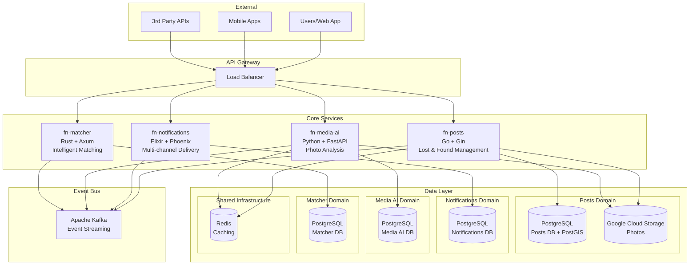

# 🔍 Findly Now

<div align="center">

**Transforming Lost & Found from heartbreak to hope through intelligent, photo-first discovery and real-time communication.**

[](./ARCHITECTURE.md)
[](./VISION.md)
[](./STANDARDS.md)
[](#license)

*Because in a world where everything can be lost, nothing should stay lost forever.*

</div>

---

## 📊 Impact at Scale

- **8+ billion items** lost annually worldwide, valued at **$2.7 trillion**
- **Only 5%** successfully reunited with owners under current systems
- **80%** of successful recoveries happen within the first 24 hours
- **Our Mission**: Increase recovery rates from 5% to 40% by 2026

## 🚀 Quick Links

| Service | Repository | Purpose | Tech Stack |
|---------|------------|---------|------------|
| **Posts** | [`fn-posts`](https://github.com/findly-now/fn-posts) | Lost & Found item management | Go, Gin, PostGIS |
| **Notifications** | [`fn-notifications`](https://github.com/findly-now/fn-notifications) | Multi-channel notifications | Elixir, Phoenix, Kafka |
| **Media AI** | [`fn-media-ai`](https://github.com/findly-now/fn-media-ai) | AI-powered photo analysis | Python, FastAPI, YOLO |
| **Matcher** | [`fn-matcher`](https://github.com/findly-now/fn-matcher) | Intelligent matching engine | Rust, Axum, PostgreSQL |
| **Contracts** | [`fn-contract`](https://github.com/findly-now/fn-contract) | API/Event schemas | OpenAPI, AsyncAPI |
| **Infrastructure** | [`fn-infra`](https://github.com/findly-now/fn-infra) | Kubernetes deployments | Helm, GKE, Docker |

## 🏗️ System Architecture

Findly Now follows a **microservices architecture** with **Domain-Driven Design (DDD)** principles, ensuring scalable, maintainable, and fault-tolerant operations.



### Service Responsibilities

#### 🏪 **fn-posts** - Posts Domain
**Bounded Context**: Lost & Found item lifecycle management
- Photo-first post creation and validation (1-10 photos required)
- Geospatial search and proximity matching (PostGIS)
- Post status transitions (active → resolved/expired/deleted)
- Event publishing for all state changes

#### 📧 **fn-notifications** - Notifications Domain
**Bounded Context**: Multi-channel notification delivery
- Event-driven notification processing from Posts domain
- Multi-channel delivery orchestration (Email, SMS, WhatsApp)
- User preference management and smart routing
- Real-time operational dashboard

#### 🤖 **fn-media-ai** - Media AI Domain
**Bounded Context**: AI-powered photo analysis and enrichment
- Computer vision analysis of photos from Posts domain
- Object recognition, scene detection, OCR processing
- AI-powered tag generation and attribute extraction
- Enhanced metadata generation with confidence scores

#### 🎯 **fn-matcher** - Matching Domain
**Bounded Context**: Intelligent item matching and discovery
- AI-powered similarity matching between lost and found items
- Advanced spatial and temporal correlation algorithms
- Confidence scoring and match ranking
- Match lifecycle management and notifications

## 🛠️ Technology Stack

<div align="center">

| Category | Technologies |
|----------|-------------|
| **Languages** |     |
| **Frameworks** |     |
| **Databases** |    |
| **Cloud** |    |
| **AI/ML** |    |
| **DevOps** |     |

</div>

## 🚀 Quick Start

### Prerequisites
- **Docker** & **Docker Compose**
- **Kubernetes** cluster (local or cloud)
- **Helm** 3.0+
- **Go** 1.25+, **Elixir** 1.16+, **Python** 3.11+, **Rust** 1.80+

### 🏠 Local Development (Complete Environment)
**NEW**: Run the entire Findly Now ecosystem locally with one command!

```bash
# Clone the workspace and start everything
git clone https://github.com/findly-now/findly-now.git
cd findly-now/fn-infra/local
make local-all-up
```

This starts:
- ✅ **Infrastructure**: PostgreSQL, Kafka, MinIO, Redis
- ✅ **All Microservices**: fn-posts, fn-media-ai, fn-matcher, fn-notifications
- ✅ **Event Streaming**: Pre-configured Kafka topics
- ✅ **Development Tools**: API docs, health dashboards, hot reload

**Access Points:**
- **Posts API**: http://localhost:8080/api/v1/posts
- **Media AI API**: http://localhost:8000/docs
- **MinIO Console**: http://localhost:9001
- **Health Checks**: All services at `/health` endpoints

### ☁️ Cloud Deployment
```bash
# Clone the workspace (all repositories)
git clone https://github.com/findly-now/fn-infra.git
cd fn-infra
make initial-setup ENV=dev
```

### Service-Specific Setup

#### Posts Service (Go)
```bash
cd fn-posts
make dev                    # Start with live reload
make e2e-test              # Run E2E tests
```

#### Notifications Service (Elixir)
```bash
cd fn-notifications
make up                    # Start with cloud services
make test                  # Run tests
```

#### Media AI Service (Python)
```bash
cd fn-media-ai
make dev                   # Start with hot reload
make test-models          # Test AI model inference
```

#### Matcher Service (Rust)
```bash
cd fn-matcher
make dev                   # Start with cargo watch
make e2e-test             # Run E2E tests
```

## 📚 Documentation Hub

| Document | Purpose | Link |
|----------|---------|------|
| **Business Vision** | Market context, user journeys, success metrics | [VISION.md](./VISION.md) |
| **System Architecture** | Domain boundaries, service interactions, patterns | [ARCHITECTURE.md](./ARCHITECTURE.md) |
| **Cloud Setup** | GKE deployment, environment configuration | [CLOUD-SETUP.md](./CLOUD-SETUP.md) |
| **Code Standards** | DDD patterns, coding guidelines, best practices | [STANDARDS.md](./STANDARDS.md) |
| **Service Interactions** | Event flows, API contracts, integration patterns | [service-interactions-overview.md](./service-interactions-overview.md) |

### Service-Specific Documentation

- **[Posts Service Docs](./posts/)** - API documentation, domain architecture, deployment
- **[Notifications Service Docs](./notifications/)** - Channel configuration, template management
- **[Media AI Service Docs](./media-ai/)** - Model documentation, pipeline configuration
- **[Matcher Service Docs](./matcher/)** - Algorithm documentation, performance tuning

## 💻 Development Workflow

### Domain-Driven Design (DDD)
- **Aggregates** maintain consistency boundaries
- **Entities** contain business logic and invariants
- **Repository pattern** with domain interfaces
- **Domain events** for all state changes
- **Anti-Corruption Layers** protect domain boundaries

### Event-Driven Architecture
- **Apache Kafka** for reliable event streaming
- **Event sourcing** for critical business events
- **Eventual consistency** between bounded contexts
- **Saga pattern** for distributed transactions

### Testing Strategy
- **E2E Tests Only** - Integration tests with real services
- **Contract Testing** - API and event schema validation
- **Performance Testing** - Load testing critical paths
- **Chaos Engineering** - Fault injection and recovery testing

### 🧪 Testing the Complete System

Test the entire microservices ecosystem:

```bash
# Test infrastructure health
curl http://localhost:8080/health    # fn-posts health
curl http://localhost:8000/          # fn-media-ai info
curl http://localhost:9001/          # MinIO console

# Test event streaming
docker exec findly-kafka kafka-topics --bootstrap-server localhost:9092 --list

# Test API endpoints
curl -X GET "http://localhost:8080/api/v1/posts/test-id"  # API validation
curl http://localhost:8000/docs                          # FastAPI docs
```

### Development Commands Summary
```bash
# Universal patterns across services
make run                   # Start service
make dev                   # Start with live reload
make test                  # Run test suite
make fmt                   # Format code
make lint                  # Run linter
make build                 # Build for production

# Local environment management
make local-all-up          # Start complete ecosystem
make local-all-down        # Stop all services
make local-all-status      # Check service health
```

## 🤝 Contributing

We welcome contributions to the Findly Now ecosystem! Here's how to get started:

### Development Setup
1. **Fork** the repository you want to contribute to
2. **Clone** your fork locally
3. **Setup** development environment using service-specific commands
4. **Create** a feature branch: `git checkout -b feature/amazing-feature`
5. **Test** your changes thoroughly
6. **Submit** a pull request

### Code Review Process
- All code must pass **automated tests**
- **DDD patterns** compliance required
- **Security review** for sensitive changes
- **Performance impact** assessment
- **Documentation** updates required

### Community Guidelines
- Follow the **Code of Conduct**
- Use **GitHub Issues** for bug reports and feature requests
- Join our **Discord** for real-time collaboration
- Review **open issues** for contribution opportunities

## 📈 Project Status

- **Current Phase**: MVP Development & Testing
- **Target Launch**: Q2 2024
- **Active Services**: 4/6 services in development
- **Test Coverage**: E2E coverage across all critical paths
- **Deployment**: Automated CI/CD with GKE

## 📄 License

This project is licensed under the **MIT License** - see the [LICENSE](LICENSE) file for details.

## 🆘 Support & Contact

- **Documentation**: [docs.findly-now.com](https://docs.findly-now.com)
- **Issues**: [GitHub Issues](https://github.com/findly-now/fn-docs/issues)
- **Discord**: [Join our community](https://discord.gg/findly-now)
- **Email**: support@findly-now.com

---

<div align="center">

**🔍 Together, we're not just building a platform - we're building hope.**

*Findly Now - Where lost becomes found.*

</div>