# Contract Service Interaction Diagrams

**Visual documentation of schema governance, contract validation workflows, and cross-service integration patterns using Mermaid diagrams.**

## Contract Governance Overview

### Complete Schema Lifecycle Management

```mermaid
graph TD
    subgraph "Development Process"
        A[👨‍💻 Developer] --> B[📝 Schema Change]
        B --> C[📤 Pull Request]
        C --> D[🔍 CI Validation]
    end

    subgraph "fn-contract Repository"
        E[📁 OpenAPI Specs]
        F[📁 AsyncAPI Specs]
        G[📁 Avro Schemas]
        H[🔧 Validation Tools]
    end

    subgraph "Validation Pipeline"
        D --> I[✅ Syntax Check]
        I --> J[🔄 Compatibility Check]
        J --> K[📊 Impact Analysis]
        K --> L{All Checks Pass?}
    end

    subgraph "Schema Registry"
        M[📚 Confluent Schema Registry]
        N[📖 Schema Versions]
        O[🛡️ Compatibility Rules]
    end

    subgraph "Consumer Services"
        P[📧 fn-notifications]
        Q[🎯 fn-matcher]
        R[🤖 fn-media-ai]
        S[📝 fn-posts]
    end

    C --> E
    C --> F
    C --> G
    H --> I

    L -->|✅ Pass| T[🚀 Schema Published]
    L -->|❌ Fail| U[📧 Notify Developer]

    T --> M
    M --> N
    M --> O

    N --> P
    N --> Q
    N --> R
    N --> S

    style D fill:#e1f5fe
    style M fill:#f3e5f5
    style L fill:#fff3e0
```

## Schema Validation Workflow

### Multi-Format Schema Validation Pipeline

```mermaid
graph TD
    subgraph "Schema Input Sources"
        A[📝 OpenAPI YAML]
        B[📋 AsyncAPI YAML]
        C[📄 Avro JSON Schema]
        D[🔄 GraphQL SDL]
    end

    subgraph "Validation Engine"
        E[🔍 Syntax Validator]
        F[📐 Semantic Validator]
        G[🎨 Style Validator]
        H[🔄 Compatibility Checker]
    end

    subgraph "Validation Rules"
        I[📏 OpenAPI 3.1 Rules]
        J[📋 AsyncAPI 2.6 Rules]
        K[⚙️ Avro Schema Rules]
        L[🏢 Org Style Guide]
    end

    subgraph "Output Reports"
        M[✅ Validation Report]
        N[📊 Compatibility Report]
        O[⚠️ Breaking Changes]
        P[💡 Recommendations]
    end

    A --> E
    B --> E
    C --> E
    D --> E

    E --> F
    F --> G
    G --> H

    I --> F
    J --> F
    K --> F
    L --> G

    H --> M
    H --> N
    H --> O
    H --> P

    style E fill:#4CAF50
    style H fill:#FF9800
    style O fill:#F44336
```

## Contract Testing Flow

### Consumer-Driven Contract Testing

```mermaid
sequenceDiagram
    participant C as Consumer Service
    participant CB as Contract Broker
    participant P as Provider Service
    participant CR as fn-contract Repo

    Note over C,P: Contract Definition Phase
    C->>CB: Define consumer contract
    CB->>CR: Store contract specification
    CR->>P: Notify of new contract requirements

    Note over C,P: Validation Phase
    P->>CB: Verify provider can meet contract
    CB->>P: Run contract tests
    P->>CB: Return test results

    alt Contract Tests Pass
        CB->>C: Contract verified ✅
        CB->>CR: Update contract status
        CR->>C: Safe to deploy
    else Contract Tests Fail
        CB->>P: Contract verification failed ❌
        CB->>C: Provider cannot meet requirements
        CR->>C: Deployment blocked
    end

    Note over C,P: Deployment Coordination
    C->>CB: Request deployment approval
    CB->>P: Check provider compatibility
    P->>CB: Confirm compatibility
    CB->>C: Approve deployment
```

## Schema Evolution Management

### Backward Compatibility Enforcement

```mermaid
graph TD
    subgraph "Schema Evolution Request"
        A[📝 New Schema Version] --> B[🔍 Extract Changes]
        B --> C{Change Type Analysis}
    end

    subgraph "Compatibility Analysis"
        C -->|Field Added| D[➕ Additive Change]
        C -->|Field Removed| E[➖ Removal Change]
        C -->|Type Changed| F[🔄 Type Change]
        C -->|Field Renamed| G[✏️ Rename Change]
    end

    subgraph "Compatibility Rules"
        D --> H{Has Default Value?}
        E --> I{Field Required?}
        F --> J{Type Compatible?}
        G --> K{Migration Path?}
    end

    subgraph "Decision Matrix"
        H -->|Yes| L[✅ Backward Compatible]
        H -->|No| M[❌ Breaking Change]
        I -->|Yes| M
        I -->|No| L
        J -->|Yes| L
        J -->|No| M
        K -->|Yes| N[⚠️ Requires Migration]
        K -->|No| M
    end

    subgraph "Actions"
        L --> O[🚀 Auto-approve]
        M --> P[🚨 Require Major Version]
        N --> Q[📋 Generate Migration Guide]
    end

    style L fill:#4CAF50
    style M fill:#F44336
    style N fill:#FF9800
```

## Cross-Service Impact Analysis

### Dependency Mapping and Impact Assessment

```mermaid
graph TD
    subgraph "Schema Change Trigger"
        A[📝 fn-posts API v1.1] --> B[🔍 Impact Analyzer]
    end

    subgraph "Consumer Discovery"
        B --> C[📋 Consumer Registry]
        C --> D[📧 fn-notifications]
        C --> E[🎯 fn-matcher]
        C --> F[🤖 fn-media-ai]
    end

    subgraph "Usage Analysis"
        D --> G[📊 Endpoint Usage Stats]
        E --> H[📊 Field Access Patterns]
        F --> I[📊 Event Consumption]
    end

    subgraph "Impact Assessment"
        G --> J{Breaking Changes?}
        H --> J
        I --> J

        J -->|Yes| K[🚨 High Impact]
        J -->|No| L[✅ Low Impact]
    end

    subgraph "Mitigation Strategy"
        K --> M[📋 Migration Plan]
        K --> N[🔄 Rollout Strategy]
        K --> O[📧 Consumer Notification]

        L --> P[✅ Safe Deployment]
    end

    subgraph "Coordination Actions"
        M --> Q[📅 Schedule Deployment]
        N --> R[🎯 Gradual Rollout]
        O --> S[📞 Team Communication]
        P --> T[🚀 Immediate Deployment]
    end

    style K fill:#F44336
    style L fill:#4CAF50
    style M fill:#FF9800
```

## Schema Registry Integration

### Runtime Schema Management

```mermaid
graph TD
    subgraph "Schema Sources"
        A[📁 fn-contract Repo] --> B[🔄 CI/CD Pipeline]
        B --> C[📚 Schema Registry]
    end

    subgraph "Registry Operations"
        C --> D[📖 Schema Storage]
        C --> E[🔄 Version Management]
        C --> F[🛡️ Compatibility Checking]
        C --> G[🗂️ Subject Management]
    end

    subgraph "Service Integration"
        H[📝 fn-posts Producer]
        I[📧 fn-notifications Consumer]
        J[🎯 fn-matcher Consumer]
        K[🤖 fn-media-ai Consumer]
    end

    subgraph "Runtime Validation"
        H --> L[✍️ Schema Validation]
        I --> M[📖 Schema Retrieval]
        J --> M
        K --> M

        L --> N{Valid Schema?}
        M --> O{Compatible Version?}
    end

    subgraph "Error Handling"
        N -->|No| P[🚨 Serialization Error]
        O -->|No| Q[🚨 Compatibility Error]
        N -->|Yes| R[✅ Message Published]
        O -->|Yes| S[✅ Message Consumed]
    end

    D --> M
    E --> M
    F --> O
    G --> M

    style P fill:#F44336
    style Q fill:#F44336
    style R fill:#4CAF50
    style S fill:#4CAF50
```

## Documentation Generation Pipeline

### Automated Documentation Workflow

```mermaid
graph TD
    subgraph "Source Schemas"
        A[📝 OpenAPI Specs] --> B[🔧 Doc Generator]
        C[📋 AsyncAPI Specs] --> B
        D[📄 Avro Schemas] --> B
    end

    subgraph "Generation Tools"
        B --> E[📚 Redoc Generator]
        B --> F[📋 AsyncAPI Generator]
        B --> G[📄 Avro Doc Generator]
        B --> H[🔄 Unified Portal Generator]
    end

    subgraph "Generated Documentation"
        E --> I[📖 API Documentation]
        F --> J[📋 Event Catalog]
        G --> K[📄 Schema Documentation]
        H --> L[🌐 Developer Portal]
    end

    subgraph "Publishing Pipeline"
        I --> M[☁️ S3 Bucket]
        J --> M
        K --> M
        L --> M

        M --> N[🌍 CloudFront CDN]
        N --> O[🌐 docs.findlynow.com]
    end

    subgraph "Cross-References"
        I --> P[🔗 Schema Links]
        J --> Q[🔗 API References]
        K --> R[🔗 Usage Examples]
        L --> S[🔗 Integration Guides]
    end

    style O fill:#4CAF50
    style L fill:#2196F3
```

## CI/CD Integration Points

### Automated Validation in Development Workflow

```mermaid
graph TD
    subgraph "Developer Workflow"
        A[👨‍💻 Code Changes] --> B[📝 Schema Updates]
        B --> C[📤 Git Push]
        C --> D[🔄 GitHub Actions]
    end

    subgraph "Validation Pipeline"
        D --> E[🔍 Schema Syntax Check]
        E --> F[📐 Semantic Validation]
        F --> G[🎨 Style Validation]
        G --> H[🔄 Compatibility Check]
        H --> I[📊 Impact Analysis]
    end

    subgraph "Quality Gates"
        I --> J{All Checks Pass?}
        J -->|No| K[❌ Block PR]
        J -->|Yes| L[✅ Approve PR]

        K --> M[📧 Notify Developer]
        L --> N[🔄 Merge to Main]
    end

    subgraph "Post-Merge Actions"
        N --> O[📚 Update Schema Registry]
        O --> P[📖 Generate Documentation]
        P --> Q[📧 Notify Consumers]
        Q --> R[🚀 Ready for Deployment]
    end

    subgraph "Consumer Notifications"
        Q --> S[📧 Breaking Changes Alert]
        Q --> T[📋 Migration Guide]
        Q --> U[📅 Deprecation Notice]
    end

    style K fill:#F44336
    style L fill:#4CAF50
    style S fill:#FF9800
```

## Schema Governance Dashboard

### Real-time Contract Management Metrics

```mermaid
graph TD
    subgraph "Data Sources"
        A[📚 Schema Registry] --> B[📊 Metrics Collector]
        C[🔄 CI/CD Pipelines] --> B
        D[📝 Contract Tests] --> B
        E[🌐 API Gateways] --> B
    end

    subgraph "Metrics Processing"
        B --> F[📈 Schema Usage Stats]
        B --> G[✅ Validation Success Rates]
        B --> H[🚨 Breaking Change Frequency]
        B --> I[📊 Consumer Adoption Rates]
    end

    subgraph "Governance Dashboard"
        F --> J[📊 Schema Usage Heatmap]
        G --> K[📈 Validation Trends]
        H --> L[🚨 Breaking Change Alerts]
        I --> M[📊 Adoption Progress]
    end

    subgraph "Alerting Rules"
        L --> N{Critical Breaking Change?}
        K --> O{Validation Rate < 95%?}
        M --> P{Low Adoption?}

        N -->|Yes| Q[📧 Emergency Alert]
        O -->|Yes| R[⚠️ Quality Alert]
        P -->|Yes| S[📋 Adoption Reminder]
    end

    subgraph "Actions"
        Q --> T[🚨 Block Deployments]
        R --> U[🔍 Investigation Required]
        S --> V[📞 Team Outreach]
    end

    style Q fill:#F44336
    style R fill:#FF9800
    style S fill:#2196F3
```

---

*These diagrams provide a comprehensive visual overview of the contract governance system, schema validation workflows, and cross-service coordination patterns. For architectural details, see [domain-architecture.md](domain-architecture.md). For API specifications, see [api-documentation.md](api-documentation.md). For deployment instructions, see [deployment-guide.md](deployment-guide.md).*