# Infrastructure Service Interaction Diagrams

**Visual documentation of infrastructure workflows, CI/CD pipelines, deployment patterns, and monitoring architecture using Mermaid diagrams.**

## Infrastructure Overview

### Cloud Infrastructure Architecture

```mermaid
graph TD
    subgraph "Google Cloud Platform"
        subgraph "GKE Cluster"
            A[🎯 fn-posts]
            B[📧 fn-notifications]
            C[🤖 fn-media-ai]
            D[🔍 fn-matcher]
        end

        subgraph "Managed Services"
            E[🗄️ Cloud SQL PostgreSQL]
            F[☁️ Cloud Storage]
            G[🔄 Pub/Sub]
            H[🔍 Cloud Monitoring]
        end

        subgraph "External Services"
            I[📊 Confluent Schema Registry]
            J[📨 SendGrid]
            K[📧 Mailchimp]
        end
    end

    subgraph "Development Tools"
        L[📝 GitHub]
        M[🔧 GitHub Actions]
        N[📦 Docker Hub]
    end

    A --> E
    A --> F
    B --> E
    B --> G
    C --> F
    C --> H
    D --> E

    A --> I
    B --> I
    C --> I
    D --> I

    B --> J
    B --> K

    L --> M
    M --> N
    M --> A
    M --> B
    M --> C
    M --> D

    style A fill:#4CAF50
    style B fill:#2196F3
    style C fill:#FF9800
    style D fill:#9C27B0
```

## CI/CD Pipeline Architecture

### Multi-Service Deployment Pipeline

```mermaid
graph TD
    subgraph "Source Control"
        A[👨‍💻 Developer] --> B[📝 Code Commit]
        B --> C[📤 Git Push]
        C --> D[🔄 GitHub]
    end

    subgraph "CI Pipeline"
        D --> E[🏗️ GitHub Actions]
        E --> F[🔧 Build & Test]
        F --> G[📦 Docker Build]
        G --> H[🔍 Security Scan]
        H --> I[📤 Push to Registry]
    end

    subgraph "Infrastructure as Code"
        I --> J[🌍 Terraform Apply]
        J --> K[⚙️ Helm Deploy]
        K --> L[🎯 K8s Rollout]
    end

    subgraph "Deployment Verification"
        L --> M[🏥 Health Checks]
        M --> N[🧪 Smoke Tests]
        N --> O{Tests Pass?}

        O -->|✅ Yes| P[✅ Deployment Success]
        O -->|❌ No| Q[🔄 Rollback]
    end

    subgraph "Monitoring & Alerting"
        P --> R[📊 Metrics Collection]
        R --> S[📈 Grafana Dashboards]
        R --> T[🚨 Alert Manager]

        Q --> U[📧 Failure Notification]
    end

    style P fill:#4CAF50
    style Q fill:#F44336
    style U fill:#FF5722
```

## GitOps Workflow

### Infrastructure Change Management

```mermaid
sequenceDiagram
    participant Dev as 👨‍💻 Developer
    participant Git as 📝 Git Repository
    participant CI as 🔧 CI Pipeline
    participant TF as 🌍 Terraform Cloud
    participant GKE as ☸️ GKE Cluster
    participant Mon as 📊 Monitoring

    Note over Dev,Mon: Infrastructure Change Workflow

    Dev->>Git: 1. Commit infrastructure changes
    Git->>CI: 2. Trigger CI pipeline

    CI->>CI: 3. Validate Terraform syntax
    CI->>CI: 4. Run security scanning
    CI->>TF: 5. Plan infrastructure changes

    TF->>TF: 6. Generate execution plan
    TF->>Git: 7. Post plan as PR comment

    Dev->>Git: 8. Review and approve PR
    Git->>CI: 9. Merge triggers deployment

    CI->>TF: 10. Apply infrastructure changes
    TF->>GKE: 11. Update cluster resources

    GKE->>Mon: 12. Report deployment status
    Mon->>Dev: 13. Send deployment notification

    alt Deployment Failure
        TF->>CI: Failed apply
        CI->>Dev: Failure notification
        Dev->>TF: Manual intervention required
    end
```

## Service Deployment Flow

### Microservice Rolling Update Process

```mermaid
graph TD
    subgraph "Pre-Deployment"
        A[📝 Code Ready] --> B[🔧 Build Pipeline]
        B --> C[🧪 Integration Tests]
        C --> D[📦 Container Image]
    end

    subgraph "Deployment Strategy"
        D --> E{Deployment Type}
        E -->|Blue/Green| F[🔵 Blue Environment]
        E -->|Rolling| G[🔄 Rolling Update]
        E -->|Canary| H[🐤 Canary Release]
    end

    subgraph "Blue/Green Process"
        F --> I[🚀 Deploy to Blue]
        I --> J[🧪 Smoke Tests]
        J --> K{Tests Pass?}
        K -->|✅ Yes| L[🔄 Switch Traffic]
        K -->|❌ No| M[💀 Terminate Blue]
        L --> N[✅ Deployment Complete]
    end

    subgraph "Rolling Update Process"
        G --> O[📊 Update 25% Pods]
        O --> P[⏱️ Wait & Monitor]
        P --> Q{Health Good?}
        Q -->|✅ Yes| R[📊 Update Next 25%]
        Q -->|❌ No| S[🔄 Rollback]
        R --> P
        R --> T[✅ 100% Updated]
    end

    subgraph "Canary Process"
        H --> U[📊 Deploy 5% Traffic]
        U --> V[📈 Monitor Metrics]
        V --> W{Metrics Good?}
        W -->|✅ Yes| X[📊 Increase to 50%]
        W -->|❌ No| Y[🔄 Route Back to Stable]
        X --> Z[📊 Full Rollout]
    end

    style N fill:#4CAF50
    style T fill:#4CAF50
    style Z fill:#4CAF50
    style M fill:#F44336
    style S fill:#F44336
    style Y fill:#F44336
```

## Infrastructure Monitoring Flow

### Observability and Alerting Pipeline

```mermaid
graph TD
    subgraph "Data Sources"
        A[☸️ Kubernetes Metrics] --> B[📊 Prometheus]
        C[📝 Application Logs] --> D[📋 Fluent Bit]
        E[🔍 APM Traces] --> F[🔗 Jaeger]
        G[🌐 Infrastructure Metrics] --> B
    end

    subgraph "Data Processing"
        B --> H[📈 Metric Aggregation]
        D --> I[📋 Log Processing]
        F --> J[🔗 Trace Analysis]

        H --> K[⚡ AlertManager]
        I --> K
        J --> K
    end

    subgraph "Visualization"
        H --> L[📊 Grafana Dashboards]
        I --> M[🔍 Kibana Logs]
        J --> N[🔗 Jaeger UI]
    end

    subgraph "Alerting Channels"
        K --> O[📧 Email Alerts]
        K --> P[💬 Slack Notifications]
        K --> Q[📱 PagerDuty Incidents]
        K --> R[🚨 Webhook Triggers]
    end

    subgraph "Response Actions"
        O --> S[👨‍💻 Manual Investigation]
        P --> S
        Q --> T[🚨 On-Call Response]
        R --> U[🤖 Auto-Remediation]
    end

    style T fill:#F44336
    style U fill:#4CAF50
```

## Disaster Recovery Workflow

### Backup and Recovery Process

```mermaid
graph TD
    subgraph "Backup Schedule"
        A[⏰ Scheduled Trigger] --> B[📊 Database Backup]
        A --> C[📁 File Storage Backup]
        A --> D[⚙️ Config Backup]
    end

    subgraph "Backup Storage"
        B --> E[☁️ Cloud SQL Backups]
        C --> F[📦 Cloud Storage Archive]
        D --> G[🔐 Secret Manager Backup]
    end

    subgraph "Disaster Scenarios"
        H[🔥 Data Center Outage] --> I{Recovery Type}
        J[💾 Data Corruption] --> I
        K[🚨 Security Incident] --> I
    end

    subgraph "Recovery Actions"
        I -->|Full Recovery| L[🔄 Restore from Backup]
        I -->|Partial Recovery| M[📊 Selective Restore]
        I -->|Failover| N[🔄 Switch to DR Region]

        L --> O[✅ Verify Data Integrity]
        M --> O
        N --> P[🔄 DNS Failover]

        O --> Q[🧪 Run Health Checks]
        P --> Q
        Q --> R[📧 Notify Stakeholders]
    end

    subgraph "Recovery Validation"
        R --> S[👨‍💻 Manual Verification]
        S --> T[📈 Monitor Performance]
        T --> U{Recovery Complete?}
        U -->|✅ Yes| V[📝 Update Runbooks]
        U -->|❌ No| W[🔧 Additional Actions]
        W --> S
    end

    style V fill:#4CAF50
    style H fill:#F44336
    style J fill:#F44336
    style K fill:#F44336
```

## Security Scanning Pipeline

### Continuous Security Assessment

```mermaid
graph TD
    subgraph "Code Security"
        A[📝 Source Code] --> B[🔍 SAST Scanning]
        B --> C[🔐 Secret Detection]
        C --> D[📋 Dependency Check]
    end

    subgraph "Infrastructure Security"
        E[🌍 Terraform Code] --> F[🔍 Policy Validation]
        F --> G[🔐 Security Baseline]
        G --> H[📋 Compliance Check]
    end

    subgraph "Container Security"
        I[📦 Docker Images] --> J[🔍 Image Scanning]
        J --> K[🔐 CVE Detection]
        K --> L[📋 Runtime Analysis]
    end

    subgraph "Runtime Security"
        M[☸️ K8s Cluster] --> N[🔍 Network Policies]
        N --> O[🔐 RBAC Validation]
        O --> P[📋 Admission Control]
    end

    subgraph "Security Reports"
        D --> Q[📊 Vulnerability Report]
        H --> Q
        L --> Q
        P --> Q

        Q --> R{Critical Issues?}
        R -->|✅ Pass| S[✅ Security Approved]
        R -->|❌ Fail| T[🚨 Block Deployment]
    end

    subgraph "Remediation"
        T --> U[📧 Security Team Alert]
        U --> V[🔧 Fix Vulnerabilities]
        V --> W[🔄 Re-scan]
        W --> R
    end

    style S fill:#4CAF50
    style T fill:#F44336
```

## Multi-Environment Promotion

### Environment Progression Pipeline

```mermaid
graph TD
    subgraph "Development"
        A[👨‍💻 Feature Branch] --> B[🔧 Auto Deploy to Dev]
        B --> C[🧪 Dev Testing]
    end

    subgraph "Staging"
        C --> D{Tests Pass?}
        D -->|✅ Yes| E[📤 Promote to Staging]
        D -->|❌ No| F[🔄 Fix and Retry]

        E --> G[🧪 Integration Tests]
        G --> H[👥 UAT Testing]
    end

    subgraph "Production"
        H --> I{UAT Approved?}
        I -->|✅ Yes| J[📋 Create Release]
        I -->|❌ No| K[📝 Document Issues]

        J --> L[🎯 Production Deploy]
        L --> M[📊 Monitor Metrics]
        M --> N[✅ Release Complete]
    end

    subgraph "Rollback Strategy"
        M --> O{Issues Detected?}
        O -->|❌ Yes| P[🚨 Trigger Rollback]
        O -->|✅ No| N

        P --> Q[🔄 Revert to Previous]
        Q --> R[📊 Verify Rollback]
        R --> S[📝 Incident Report]
    end

    style N fill:#4CAF50
    style P fill:#F44336
    style F fill:#FF9800
    style K fill:#FF9800
```

---

*These diagrams provide comprehensive visual documentation of infrastructure workflows, deployment patterns, and operational procedures. For implementation details, see [deployment-guide.md](deployment-guide.md). For API specifications, see [api-documentation.md](api-documentation.md). For architectural decisions, see [domain-architecture.md](domain-architecture.md).*