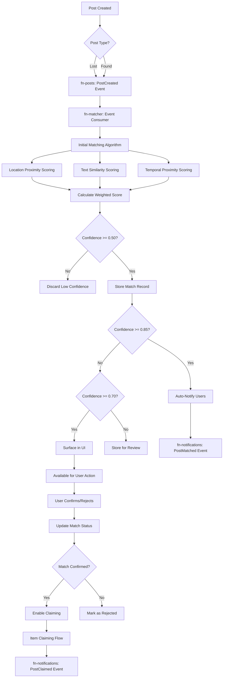
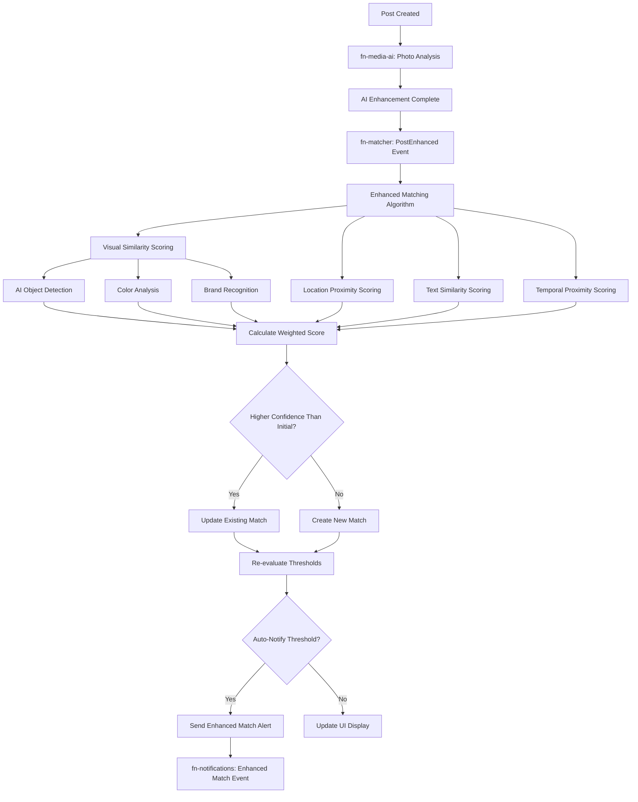
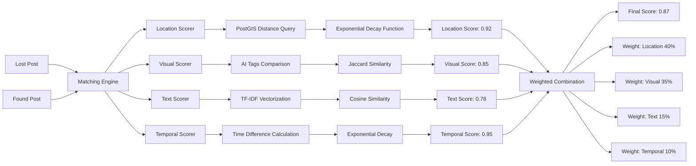
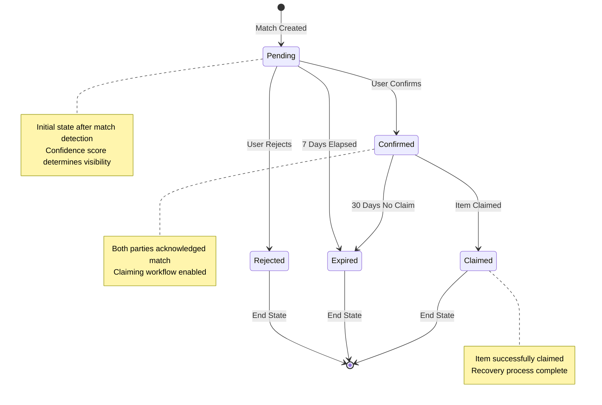
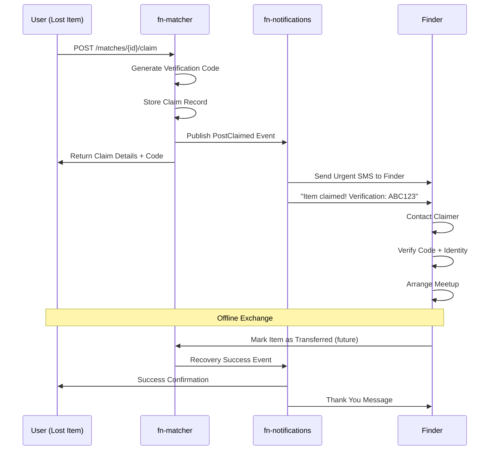
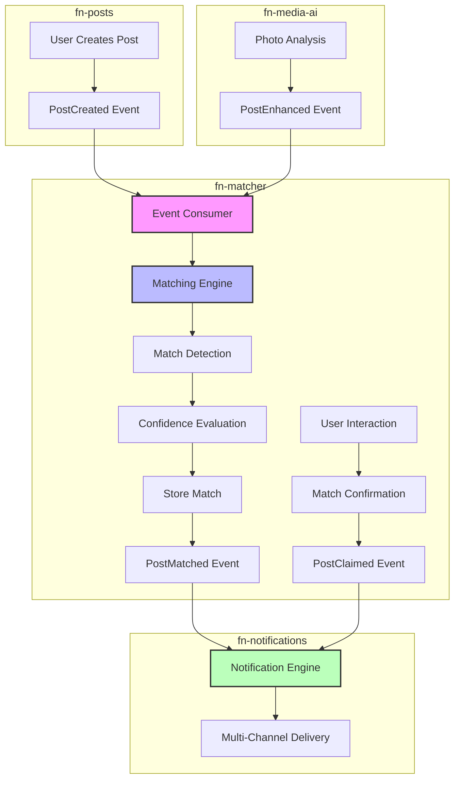
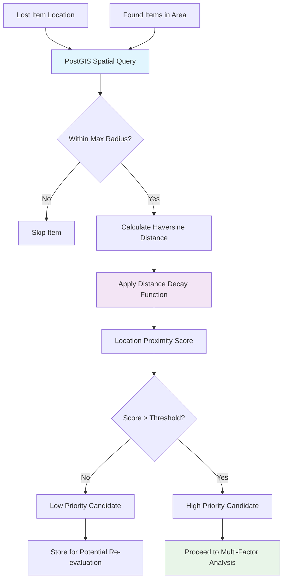
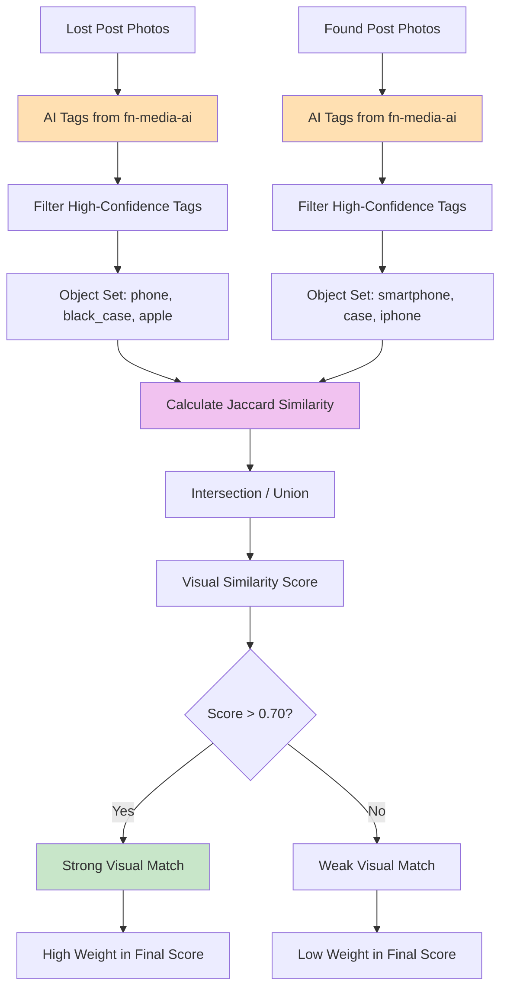
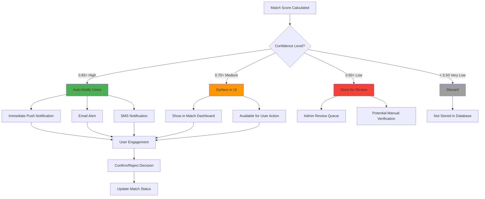
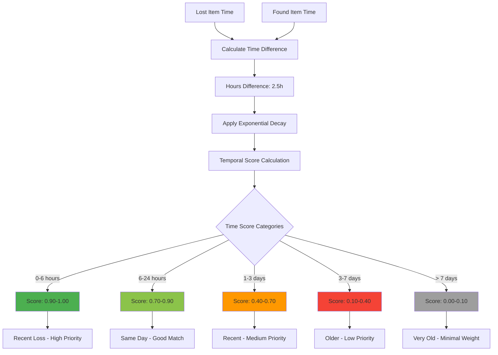

# Matching Flow Diagrams

**Visual representation of the intelligent matching flows and processes in the fn-matcher service.**

## 1. Overall Matching Flow

## 2. Enhanced Matching Flow with AI

## 3. Multi-Factor Scoring Algorithm

## 4. Match Lifecycle State Machine

## 5. Item Claiming Workflow

## 6. Event-Driven Architecture Flow

## 7. Location-Based Matching Algorithm

## 8. Visual Similarity Matching Process

## 9. Confidence-Based Action Flow

## 10. Temporal Proximity Analysis

---

*These diagrams illustrate the complex matching flows and algorithms within the fn-matcher service. For detailed technical implementation, see [domain-architecture.md](domain-architecture.md). For API integration examples, see [api-documentation.md](api-documentation.md).*