# Media AI Service Interaction Diagrams

**Visual documentation of the Media AI service interactions, AI processing workflows, and system architecture using Mermaid diagrams.**

## Service Integration Overview

### Complete AI Processing Event Flow

```mermaid
graph TD
    subgraph "External Services"
        GCS[☁️ Google Cloud Storage<br/>Photo Repository]
        OpenAI[🤖 OpenAI GPT-4 Vision<br/>AI Analysis API]
        Redis[🗄️ Redis<br/>Cache Layer]
    end

    subgraph "Event Bus (Kafka)"
        PostCreated[📨 post.created]
        PostEnhanced[📨 post.enhanced]
        ProcessingError[📨 processing.error]
    end

    subgraph "fn-posts Domain"
        Posts[📝 Posts Service]
        PhotoUpload[📸 Photo Upload Handler]
    end

    subgraph "fn-media-ai Domain"
        KafkaConsumer[📡 Kafka Consumer]
        EventHandler[⚡ Post Created Handler]
        AIController[🧠 AI Processing Controller]

        subgraph "AI Pipeline"
            PhotoDownloader[📥 Photo Downloader]
            ObjectDetector[👁️ Object Detection]
            SceneClassifier[🏞️ Scene Classification]
            OCRExtractor[📝 OCR Text Extraction]
            LocationInferrer[📍 Location Inference]
            MetadataCombiner[🔄 Metadata Combiner]
        end

        EventPublisher[📤 Event Publisher]
        CacheManager[🗃️ Cache Manager]
    end

    subgraph "Downstream Services"
        PostsUpdate[📝 fn-posts<br/>Enhancement Updates]
        Matcher[🎯 fn-matcher<br/>Enhanced Matching]
        Notifications[📧 fn-notifications<br/>Processing Updates]
    end

    Posts --> PhotoUpload
    PhotoUpload --> GCS
    Posts --> PostCreated
    PostCreated --> KafkaConsumer
    KafkaConsumer --> EventHandler
    EventHandler --> AIController

    AIController --> PhotoDownloader
    PhotoDownloader --> GCS
    PhotoDownloader --> ObjectDetector
    ObjectDetector --> SceneClassifier
    SceneClassifier --> OCRExtractor
    OCRExtractor --> LocationInferrer
    LocationInferrer --> OpenAI
    LocationInferrer --> MetadataCombiner

    MetadataCombiner --> CacheManager
    CacheManager --> Redis
    MetadataCombiner --> EventPublisher
    EventPublisher --> PostEnhanced
    EventPublisher --> ProcessingError

    PostEnhanced --> PostsUpdate
    PostEnhanced --> Matcher
    PostEnhanced --> Notifications
```

## AI Processing Pipeline Architecture

### Multi-Model AI Processing Workflow

```mermaid
graph TD
    subgraph "Input Processing"
        A[📨 PostCreated Event] --> B[📋 Event Validation]
        B --> C[🔍 Photo URL Extraction]
        C --> D[📥 Photo Download from GCS]
    end

    subgraph "Parallel AI Model Processing"
        D --> E1[🎯 YOLO Object Detection]
        D --> E2[🏞️ ResNet Scene Classification]
        D --> E3[📝 Tesseract OCR]
        D --> E4[🤖 GPT-4 Vision Analysis]

        E1 --> F1[📦 Objects & Attributes]
        E2 --> F2[🌍 Scene Context]
        E3 --> F3[📄 Text & Labels]
        E4 --> F4[📍 Location Context]
    end

    subgraph "Result Processing"
        F1 --> G[🔄 Metadata Combiner]
        F2 --> G
        F3 --> G
        F4 --> G

        G --> H[📊 Confidence Evaluator]
        H --> I{Confidence Level?}

        I -->|≥85%| J[✅ Auto-Enhance]
        I -->|70-84%| K[💡 Suggest Tags]
        I -->|50-69%| L[👀 Human Review]
        I -->|<50%| M[🗑️ Discard]

        J --> N[📤 Publish Enhancement]
        K --> N
        L --> N
    end

    subgraph "Output Events"
        N --> O[📨 post.enhanced Event]
        M --> P[📨 processing.error Event]
    end

    style E1 fill:#ff9999
    style E2 fill:#99ccff
    style E3 fill:#99ff99
    style E4 fill:#ffcc99
```

## Confidence-Based Enhancement Flow

### Enhancement Level Decision Tree

```mermaid
graph TD
    A[🧠 AI Analysis Complete] --> B[📊 Calculate Overall Confidence]
    B --> C{Confidence Score}

    C -->|≥ 0.85| D[🚀 Auto-Enhancement]
    C -->|0.70 - 0.84| E[💭 Suggestion Mode]
    C -->|0.50 - 0.69| F[👀 Human Review Required]
    C -->|< 0.50| G[🗑️ Discard Results]

    D --> D1[📝 Update Post Automatically]
    D --> D2[🏷️ Add High-Confidence Tags]
    D --> D3[📄 Enhance Description]
    D --> D4[📤 Publish Enhancement Event]

    E --> E1[💡 Generate Tag Suggestions]
    E --> E2[📋 Create Review Queue Entry]
    E --> E3[📧 Notify User for Approval]

    F --> F1[🔍 Flag for Manual Review]
    F --> F2[👨‍💼 Add to Admin Queue]
    F --> F3[📊 Track for Model Training]

    G --> G1[📝 Log Low Confidence Result]
    G --> G2[🗃️ Store for Analytics Only]

    D4 --> H[📨 Event: post.enhanced]
    E3 --> I[📨 Event: tags.suggested]
    F2 --> J[📨 Event: review.required]
    G2 --> K[📨 Event: processing.completed]

    style D fill:#90EE90
    style E fill:#FFE4B5
    style F fill:#FFA07A
    style G fill:#D3D3D3
```

## Event Processing Sequence

### PostCreated to PostEnhanced Flow

## Error Handling and Retry Patterns

### Error Recovery Workflow

```mermaid
graph TD
    A[📨 PostCreated Event] --> B[⚡ Event Processing]
    B --> C{Processing Success?}

    C -->|✅ Success| D[📤 Publish Enhancement]
    C -->|❌ Error| E[🔍 Error Classification]

    E --> F{Error Type}

    F -->|Photo Download| G[📥 Download Error Handler]
    F -->|AI Model| H[🧠 Model Error Handler]
    F -->|API Rate Limit| I[⏱️ Rate Limit Handler]
    F -->|Network| J[🌐 Network Error Handler]
    F -->|Unknown| K[❓ Generic Error Handler]

    G --> G1[🔄 Retry with Backoff]
    G1 --> G2{Max Retries?}
    G2 -->|No| G3[⏰ Exponential Backoff]
    G3 --> B
    G2 -->|Yes| L[💀 Dead Letter Queue]

    H --> H1[🔄 Fallback Model]
    H1 --> H2{Fallback Success?}
    H2 -->|Yes| D
    H2 -->|No| M[📝 Partial Results]

    I --> I1[⏳ Wait for Rate Limit Reset]
    I1 --> I2[🔄 Retry Request]
    I2 --> B

    J --> J1[🔄 Circuit Breaker Check]
    J1 --> J2{Circuit Open?}
    J2 -->|Closed| J3[🔄 Retry Immediately]
    J2 -->|Open| J4[⏰ Wait for Circuit Reset]
    J3 --> B
    J4 --> B

    K --> K1[📝 Log Unknown Error]
    K1 --> L

    L --> N[📨 Publish Error Event]
    M --> O[📨 Publish Partial Enhancement]

    style G fill:#FFB6C1
    style H fill:#DDA0DD
    style I fill:#F0E68C
    style J fill:#98FB98
    style K fill:#FFA07A
```

## Cache Strategy and Data Flow

### Redis Caching Architecture

```mermaid
graph TD
    subgraph "Cache Layers"
        L1[🚀 L1: Model Weights<br/>TTL: 24h]
        L2[⚡ L2: AI Results<br/>TTL: 1h]
        L3[📊 L3: Photo Metadata<br/>TTL: 30m]
        L4[🔍 L4: Analysis Queue<br/>TTL: 5m]
    end

    subgraph "AI Processing Flow"
        A[📸 Photo Processing Request] --> B{Check L3 Cache}
        B -->|Hit| C[📊 Return Cached Metadata]
        B -->|Miss| D[🧠 Start AI Analysis]

        D --> E{Check L1 Cache}
        E -->|Hit| F[⚡ Load Cached Models]
        E -->|Miss| G[📥 Download Model Weights]
        G --> H[💾 Cache in L1]
        H --> F

        F --> I[🔍 Run AI Inference]
        I --> J{Check L2 Cache}
        J -->|Hit| K[📋 Combine with Cached Results]
        J -->|Miss| L[🧮 Complete Analysis]

        L --> M[💾 Cache Results in L2]
        M --> N[💾 Cache Metadata in L3]
        N --> O[📤 Return Enhanced Data]

        K --> O
        C --> O
    end

    subgraph "Cache Management"
        P[🔄 Cache Invalidation] --> Q{Invalidation Type}
        Q -->|Model Update| R[🗑️ Clear L1 Cache]
        Q -->|Data Change| S[🗑️ Clear L2 & L3]
        Q -->|Manual| T[🗑️ Clear All Caches]

        U[📊 Cache Monitoring] --> V[📈 Hit Rate Metrics]
        V --> W[🎯 Optimize Cache TTL]
    end

    style L1 fill:#FF6B6B
    style L2 fill:#4ECDC4
    style L3 fill:#45B7D1
    style L4 fill:#96CEB4
```

## Model Performance and Monitoring

### AI Model Metrics Dashboard

```mermaid
graph TD
    subgraph "Model Performance Tracking"
        A[📊 Model Metrics Collector] --> B[🎯 YOLO Performance]
        A --> C[🏞️ ResNet Performance]
        A --> D[📝 OCR Performance]
        A --> E[🤖 GPT-4V Performance]

        B --> B1[⏱️ Inference Time: 1.2s avg]
        B --> B2[🎯 Accuracy: 92%]
        B --> B3[💾 Memory Usage: 512MB]

        C --> C1[⏱️ Inference Time: 0.8s avg]
        C --> C2[🎯 Accuracy: 88%]
        C --> C3[💾 Memory Usage: 256MB]

        D --> D1[⏱️ Inference Time: 0.6s avg]
        D --> D2[🎯 Accuracy: 94%]
        D --> D3[💾 Memory Usage: 128MB]

        E --> E1[⏱️ API Call Time: 2.1s avg]
        E --> E2[🎯 Accuracy: 89%]
        E --> E3[💰 Token Usage: 150/req]
    end

    subgraph "Performance Monitoring"
        F[📈 Prometheus Metrics] --> G[🔍 Grafana Dashboards]
        G --> H[⚠️ Alert Rules]

        H --> I{Performance Threshold}
        I -->|Latency > 5s| J[🚨 High Latency Alert]
        I -->|Accuracy < 80%| K[📉 Low Accuracy Alert]
        I -->|Memory > 2GB| L[💾 High Memory Alert]
        I -->|Error Rate > 5%| M[❌ High Error Alert]

        J --> N[📧 Notify DevOps Team]
        K --> O[🔧 Trigger Model Retraining]
        L --> P[📈 Scale Resources]
        M --> Q[🔍 Investigate Error Causes]
    end

    subgraph "Model Optimization Loop"
        R[📊 Performance Analysis] --> S[🎯 Identify Bottlenecks]
        S --> T[🔧 Optimization Strategy]
        T --> U[⚡ Apply Optimizations]
        U --> V[📏 Measure Improvements]
        V --> R
    end

    style B fill:#FF9999
    style C fill:#99CCFF
    style D fill:#99FF99
    style E fill:#FFCC99
```

## Integration with External Services

### External API Interaction Flow

```mermaid
graph LR
    subgraph "fn-media-ai Service"
        A[🧠 AI Controller] --> B[📡 External API Manager]
        B --> C[🔧 Circuit Breaker]
        C --> D[⏱️ Rate Limiter]
        D --> E[🔄 Retry Handler]
    end

    subgraph "External APIs"
        F[🤖 OpenAI GPT-4 Vision]
        G[☁️ Google Cloud Storage]
        H[🔍 Google Vision API]
        I[🏷️ AWS Rekognition]
    end

    subgraph "API Management Patterns"
        J[📊 API Health Monitor]
        K[📈 Usage Tracker]
        L[💰 Cost Monitor]
        M[🚦 Fallback Manager]
    end

    E --> F
    E --> G
    E --> H
    E --> I

    F --> J
    G --> J
    H --> J
    I --> J

    J --> K
    K --> L
    L --> M

    M --> N{API Healthy?}
    N -->|Yes| O[✅ Use Primary API]
    N -->|No| P[🔄 Use Fallback API]

    O --> Q[📊 Log Success Metrics]
    P --> R[⚠️ Log Fallback Usage]

    style F fill:#FF6B6B
    style G fill:#4ECDC4
    style H fill:#45B7D1
    style I fill:#96CEB4
```

## Scalability and Load Distribution

### Horizontal Scaling Architecture

## Development and Testing Workflow

### CI/CD Pipeline Integration

## Real-time Processing Dashboard

### Live Metrics Visualization

```mermaid
graph TD
    subgraph "Real-time Metrics Dashboard"
        A[📊 Live Metrics Collector] --> B[📈 Processing Rate]
        A --> C[⏱️ Average Latency]
        A --> D[📊 Confidence Distribution]
        A --> E[🎯 Model Accuracy]
        A --> F[💰 API Costs]

        B --> B1[📈 150 photos/min]
        C --> C1[⏱️ 3.2s average]
        D --> D1[📊 85% high confidence]
        E --> E1[🎯 91% accuracy]
        F --> F1[💰 $24.50/hour]
    end

    subgraph "Alert System"
        G[🚨 Alert Manager] --> H{Threshold Check}
        H -->|Latency > 5s| I[⚠️ Performance Alert]
        H -->|Accuracy < 85%| J[📉 Quality Alert]
        H -->|Cost > $50/h| K[💰 Budget Alert]
        H -->|Queue > 100| L[📈 Backlog Alert]

        I --> M[📱 SMS to On-call]
        J --> N[📧 Email to ML Team]
        K --> O[💬 Slack to Finance]
        L --> P[📞 Page DevOps]
    end

    subgraph "Auto-scaling Triggers"
        Q[📊 Resource Monitor] --> R{Resource Usage}
        R -->|CPU > 80%| S[📈 Scale Up Pods]
        R -->|Memory > 2GB| T[💾 Add Memory]
        R -->|Queue > 50| U[🔄 Add Workers]
        R -->|Cost > $40/h| V[🎯 Optimize Models]

        S --> W[➕ +2 Replicas]
        T --> X[📦 Request More Memory]
        U --> Y[🔄 Horizontal Scale]
        V --> Z[⚡ Use Smaller Models]
    end

    style B1 fill:#90EE90
    style C1 fill:#FFE4B5
    style D1 fill:#87CEEB
    style E1 fill:#DDA0DD
    style F1 fill:#F0E68C
```

---

*These diagrams provide a comprehensive visual overview of the fn-media-ai service architecture, processing flows, and system interactions. For architectural details, see [domain-architecture.md](domain-architecture.md). For API specifications, see [api-documentation.md](api-documentation.md). For deployment instructions, see [deployment-guide.md](deployment-guide.md).*