# Notifications Service Interaction Diagrams

**Visual documentation of the Notifications service interactions, event flows, and enterprise resilience patterns using Mermaid diagrams.**

## Service Integration Overview

### Complete Notification Ecosystem

```mermaid
graph TD
    subgraph "Event Sources"
        A[📝 fn-posts] --> B[📨 Kafka Topics]
        C[🎯 fn-matcher] --> B
        D[👤 fn-users] --> B
    end

    subgraph "fn-notifications Core"
        E[🎭 Broadway Event Processors] --> F[🛡️ Anti-Corruption Layer]
        F --> G[💼 Notification Service]
        G --> H[🧠 Channel Routing Service]
        H --> I[🔄 Delivery Orchestrator]
    end

    subgraph "Resilience Layer"
        J[⚡ Circuit Breakers] --> K[🏗️ Bulkhead Pools]
        K --> L[🔄 Retry Logic]
        L --> M[📋 Dead Letter Queue]
    end

    subgraph "Delivery Channels"
        N[📧 Email Adapter] --> O[📮 SendGrid/Mailgun]
        P[📱 SMS Adapter] --> Q[📞 Twilio]
        R[💬 WhatsApp Adapter] --> Q
    end

    subgraph "Data & Caching"
        S[🗄️ PostgreSQL] --> T[⚡ Cachex/Redis]
        T --> U[👤 User Preferences]
    end

    subgraph "Monitoring & UI"
        V[📊 Phoenix LiveView Dashboard] --> W[📈 Real-time Metrics]
        W --> X[🚨 Alerting]
    end

    B --> E
    I --> J
    J --> N
    J --> P
    J --> R
    G --> S
    U --> H
    I --> V

    style B fill:#e3f2fd
    style F fill:#e8f5e8
    style J fill:#fff3e0
    style N fill:#f3e5f5
    style S fill:#fce4ec
    style V fill:#f1f8e9
```

## Event-Driven Architecture Flow

### Complete Event Processing Pipeline

```mermaid
sequenceDiagram
    participant Posts as 📝 fn-posts
    participant Kafka as 📨 Confluent Kafka
    participant Broadway as 🎭 Broadway
    participant ACL as 🛡️ Anti-Corruption Layer
    participant Service as 💼 Notification Service
    participant Router as 🧠 Channel Router
    participant CB as ⚡ Circuit Breaker
    participant Email as 📧 Email Adapter
    participant SMS as 📱 SMS Adapter
    participant DB as 🗄️ Database
    participant Dashboard as 📊 LiveView Dashboard

    Note over Posts, Dashboard: Lost Item Posted - Notification Flow

    Posts->>Kafka: Publish post.created event
    Note right of Kafka: Event: {type: "post.created", data: {...}}

    Kafka->>Broadway: Consume event (Broadway stages)
    Broadway->>Broadway: Process with concurrency (10 stages)

    Broadway->>ACL: Translate external event
    ACL->>ACL: Convert to internal command
    Note right of ACL: SendNotificationCommand created

    ACL->>Service: Execute notification command
    Service->>Service: Load user preferences (cached)
    Service->>Router: Determine channels for post_confirmation

    Router->>Router: Apply business rules
    Note right of Router: post_confirmation → [email] only

    Service->>DB: Create notification record
    DB-->>Service: Notification ID

    Service->>CB: Check email circuit state
    CB-->>Service: Circuit CLOSED - proceed

    Service->>Email: Deliver notification
    Email->>Email: Format email with template
    Email->>SendGrid: Send via Swoosh adapter

    alt Email delivery successful
        SendGrid-->>Email: Delivery confirmation
        Email-->>Service: {:ok, :delivered}
        Service->>DB: Update status to 'delivered'
        Service->>Dashboard: Broadcast success event
    else Email delivery failed
        SendGrid-->>Email: Delivery error
        Email-->>Service: {:error, reason}
        Service->>CB: Record failure
        Service->>DB: Update status to 'failed'
        Service->>Dashboard: Broadcast failure event
    end

    Dashboard->>Dashboard: Update real-time metrics
    Dashboard-->>User: Live notification status
```

## Multi-Channel Delivery Architecture

### Channel Selection and Delivery Flow

```mermaid
flowchart TD
    A[📨 Notification Command] --> B[👤 Load User Preferences]
    B --> C{Global Notifications Enabled?}
    C -->|No| D[❌ Skip Delivery]
    C -->|Yes| E[🧠 Channel Router]

    E --> F{Notification Type}
    F -->|post_confirmation| G[📧 Email Only]
    F -->|match_detected| H[📧📱 Email + SMS]
    F -->|urgent_claim| I[📧📱💬 All Channels]
    F -->|post_resolved| J[📧 Email Only]

    G --> K[🔍 Filter Available Channels]
    H --> K
    I --> K
    J --> K

    K --> L{Contact Info Available?}
    L -->|No Email| M[❌ Skip Email]
    L -->|No Phone| N[❌ Skip SMS/WhatsApp]
    L -->|Available| O[✅ Queue for Delivery]

    O --> P{Quiet Hours Check}
    P -->|In Quiet Hours + Non-Urgent| Q[📧 Email Only]
    P -->|Normal Hours or Urgent| R[🚀 Multi-Channel Delivery]

    Q --> S[📧 Email Delivery]
    R --> T[⚡ Parallel Delivery]

    T --> U[📧 Email via Circuit Breaker]
    T --> V[📱 SMS via Circuit Breaker]
    T --> W[💬 WhatsApp via Circuit Breaker]

    U --> X{Email Circuit}
    V --> Y{SMS Circuit}
    W --> Z{WhatsApp Circuit}

    X -->|CLOSED| AA[📮 SendGrid Delivery]
    X -->|OPEN| BB[❌ Fast Fail]
    Y -->|CLOSED| CC[📞 Twilio SMS]
    Y -->|OPEN| BB
    Z -->|CLOSED| DD[💬 Twilio WhatsApp]
    Z -->|OPEN| BB

    style A fill:#e3f2fd
    style E fill:#e8f5e8
    style K fill:#fff3e0
    style T fill:#f3e5f5
    style X fill:#fce4ec
    style Y fill:#fce4ec
    style Z fill:#fce4ec
```

### Channel Adapter Architecture

## Enterprise Resilience Patterns

### Circuit Breaker State Machine

```mermaid
stateDiagram-v2
    [*] --> Closed : Service Start

    Closed --> Open : Failure Threshold Reached<br/>(5 failures in 60s)
    Open --> HalfOpen : Reset Timeout<br/>(5 minutes)
    HalfOpen --> Closed : Test Request Success
    HalfOpen --> Open : Test Request Failure

    Closed : ✅ Normal Operation
    Closed : • Requests pass through
    Closed : • Monitor failure rate
    Closed : • Track response times

    Open : ❌ Fail Fast Mode
    Open : • Block all requests
    Open : • Return cached response
    Open : • Reduce system load

    HalfOpen : 🔍 Recovery Test
    HalfOpen : • Allow single request
    HalfOpen : • Evaluate health
    HalfOpen : • Quick state decision

    note right of Closed
        Email: max 5 failures/60s
        SMS: max 3 failures/60s
        WhatsApp: max 3 failures/60s
    end note

    note right of Open
        Email: 5min reset timeout
        SMS: 10min reset timeout
        WhatsApp: 10min reset timeout
    end note
```

### Bulkhead Resource Isolation

```mermaid
graph TD
    subgraph "Resource Pool Management"
        A[📨 Incoming Notification] --> B{Channel Type}

        B -->|Email| C[📧 Email Pool<br/>Max: 10 concurrent<br/>Timeout: 30s]
        B -->|SMS| D[📱 SMS Pool<br/>Max: 5 concurrent<br/>Timeout: 15s]
        B -->|WhatsApp| E[💬 WhatsApp Pool<br/>Max: 5 concurrent<br/>Timeout: 15s]

        C --> F{Pool Available?}
        D --> G{Pool Available?}
        E --> H{Pool Available?}

        F -->|Yes| I[✅ Acquire Slot]
        F -->|No| J[❌ Queue/Reject]

        G -->|Yes| K[✅ Acquire Slot]
        G -->|No| L[❌ Queue/Reject]

        H -->|Yes| M[✅ Acquire Slot]
        H -->|No| N[❌ Queue/Reject]

        I --> O[📮 SendGrid API]
        K --> P[📞 Twilio SMS]
        M --> Q[💬 Twilio WhatsApp]

        O --> R[🔓 Release Slot]
        P --> S[🔓 Release Slot]
        Q --> T[🔓 Release Slot]
    end

    style C fill:#e3f2fd
    style D fill:#e8f5e8
    style E fill:#fff3e0
    style J fill:#ffebee
    style L fill:#ffebee
    style N fill:#ffebee
```

### Retry Logic with Exponential Backoff

```mermaid
sequenceDiagram
    participant Service as 💼 Notification Service
    participant Adapter as 📧 Email Adapter
    participant External as 📮 SendGrid
    participant Oban as 🔄 Oban Jobs
    participant DB as 🗄️ Database

    Note over Service, DB: Failed Delivery with Retry Logic

    Service->>Adapter: Deliver notification
    Adapter->>External: Send email request
    External-->>Adapter: ❌ Temporary failure (503)
    Adapter-->>Service: {:error, :service_unavailable}

    Service->>DB: Update status to 'failed'
    Service->>Service: Check retry count (0 < 3)
    Service->>Oban: Schedule retry job

    Note over Oban: Exponential backoff calculation<br/>Retry 1: 1 second + jitter

    Oban->>Service: Execute retry (attempt 1)
    Service->>Adapter: Retry delivery
    Adapter->>External: Send email request
    External-->>Adapter: ❌ Still failing (503)
    Adapter-->>Service: {:error, :service_unavailable}

    Service->>DB: Update retry_count = 1
    Service->>Oban: Schedule retry job

    Note over Oban: Retry 2: 2 seconds + jitter

    Oban->>Service: Execute retry (attempt 2)
    Service->>Adapter: Retry delivery
    Adapter->>External: Send email request
    External-->>Adapter: ❌ Still failing (503)
    Adapter-->>Service: {:error, :service_unavailable}

    Service->>DB: Update retry_count = 2
    Service->>Oban: Schedule retry job

    Note over Oban: Retry 3: 4 seconds + jitter

    Oban->>Service: Execute retry (attempt 3)
    Service->>Adapter: Final retry attempt
    Adapter->>External: Send email request
    External-->>Adapter: ✅ Success (200)
    Adapter-->>Service: {:ok, :delivered}

    Service->>DB: Update status to 'delivered'
    Service->>Service: Clear retry jobs

    Note over Service, DB: Total delivery time: ~7 seconds<br/>Success after 3 attempts
```

## User Preferences Management

### Preference Loading and Caching Strategy

### Smart Channel Routing Logic

```mermaid
flowchart TD
    A[📨 Notification Command] --> B[📋 Load User Preferences]
    B --> C{Global Enabled?}
    C -->|No| D[❌ Exit - Notifications Disabled]
    C -->|Yes| E[🎯 Notification Type Analysis]

    E --> F{Notification Type}
    F -->|post_confirmation| G[📧 Email Primary Channel]
    F -->|match_detected| H[📧📱 Email + SMS if enabled]
    F -->|urgent_claim| I[📧📱💬 All Available Channels]
    F -->|post_resolved| J[📧 Email Success Story]
    F -->|welcome| K[📧 Email Onboarding]

    G --> L[🔍 Validate Email Available]
    H --> M[🔍 Validate Email + SMS Available]
    I --> N[🔍 Validate All Channels]
    J --> L
    K --> L

    L --> O{Email Address?}
    O -->|Yes| P[✅ Email Queued]
    O -->|No| Q[❌ No Email Address]

    M --> R{Email + SMS Check}
    R -->|Both Available| S[✅ Email + SMS Queued]
    R -->|Email Only| P
    R -->|Neither| T[❌ No Contact Info]

    N --> U{All Channels Check}
    U -->|All Available| V[✅ Multi-Channel Queued]
    U -->|Partial| W[✅ Available Channels Queued]
    U -->|None| T

    P --> X[😴 Quiet Hours Check]
    S --> X
    V --> X
    W --> X

    X --> Y{In Quiet Hours?}
    Y -->|Yes + Urgent| Z[🚨 Override Quiet Hours]
    Y -->|Yes + Normal| AA[📧 Email Only]
    Y -->|No| BB[🚀 Proceed as Planned]

    Z --> BB
    AA --> CC[📧 Email Delivery]
    BB --> DD[🔄 Multi-Channel Delivery]

    style A fill:#e3f2fd
    style E fill:#e8f5e8
    style X fill:#fff3e0
    style DD fill:#f3e5f5
```

## Real-time Dashboard Architecture

### Phoenix LiveView Real-time Updates

```mermaid
sequenceDiagram
    participant User as 👤 Dashboard User
    participant Browser as 🌐 Browser
    participant LiveView as 📺 Phoenix LiveView
    participant PubSub as 📢 Phoenix PubSub
    participant Service as 💼 Notification Service
    participant DB as 🗄️ Database

    Note over User, DB: Real-time Notification Monitoring

    User->>Browser: Navigate to dashboard
    Browser->>LiveView: HTTP request /dashboard
    LiveView->>DB: Load initial dashboard data
    DB-->>LiveView: Recent notifications & stats

    LiveView->>PubSub: Subscribe to "notifications" topic
    LiveView-->>Browser: Render dashboard with WebSocket
    Browser-->>User: Display live dashboard

    Note over Service, DB: New notification processed

    Service->>Service: Process notification delivery
    Service->>DB: Update notification status
    Service->>PubSub: Broadcast notification_sent event

    PubSub->>LiveView: Receive notification_sent event
    LiveView->>LiveView: Update dashboard state
    LiveView->>Browser: Push update via WebSocket
    Browser->>Browser: Update UI without page refresh
    Browser-->>User: Show real-time notification

    Note over Service, DB: Delivery failure occurs

    Service->>Service: Handle delivery failure
    Service->>DB: Update failure status
    Service->>PubSub: Broadcast delivery_failed event

    PubSub->>LiveView: Receive delivery_failed event
    LiveView->>LiveView: Update failure metrics
    LiveView->>Browser: Push failure alert
    Browser->>Browser: Show failure notification
    Browser-->>User: Real-time failure alert

    Note over User, DB: Admin retry action

    User->>Browser: Click retry failed notification
    Browser->>LiveView: Retry button clicked
    LiveView->>Service: Trigger manual retry
    Service->>Service: Execute retry logic
    Service-->>LiveView: Retry initiated
    LiveView->>Browser: Update UI with retry status
    Browser-->>User: Show retry in progress
```

### Dashboard Component Architecture

```mermaid
graph TD
    subgraph "Phoenix LiveView Dashboard"
        A[📊 DashboardLive] --> B[📈 MetricsComponent]
        A --> C[📋 NotificationListComponent]
        A --> D[🚨 AlertsComponent]
        A --> E[⚙️ AdminActionsComponent]
    end

    subgraph "Real-time Data Sources"
        F[📢 Phoenix PubSub] --> G[📨 notification_sent]
        F --> H[❌ delivery_failed]
        F --> I[🔄 retry_attempted]
        F --> J[⚡ circuit_breaker_opened]
    end

    subgraph "Dashboard Features"
        B --> K[📊 Success Rate Chart]
        B --> L[⏱️ Delivery Time Histogram]
        B --> M[📈 Volume Trends]

        C --> N[📋 Recent Notifications]
        C --> O[🔍 Search & Filter]
        C --> P[📄 Pagination]

        D --> Q[🚨 Failed Deliveries]
        D --> R[⚡ Circuit Breaker Status]
        D --> S[📊 System Health]

        E --> T[🔄 Retry Failed Notifications]
        E --> U[📧 Send Test Notifications]
        E --> V[⚙️ Configure Preferences]
    end

    G --> A
    H --> A
    I --> A
    J --> A

    style A fill:#e3f2fd
    style F fill:#e8f5e8
    style K fill:#fff3e0
    style Q fill:#ffebee
```

## Anti-Corruption Layer

### Event Translation Architecture

```mermaid
graph TD
    subgraph "External Domain Events"
        A[📝 fn-posts Events] --> B[post.created]
        A --> C[post.matched]
        A --> D[post.claimed]
        A --> E[post.resolved]

        F[🎯 fn-matcher Events] --> G[match.detected]
        F --> H[match.confirmed]
        F --> I[match.expired]

        J[👤 fn-users Events] --> K[user.registered]
        J --> L[organization.staff_added]
    end

    subgraph "Anti-Corruption Layer"
        M[🛡️ EventTranslator] --> N{Event Type Router}

        N -->|post.*| O[📝 PostEventTranslator]
        N -->|match.*| P[🎯 MatchEventTranslator]
        N -->|user.*| Q[👤 UserEventTranslator]
        N -->|unknown| R[❌ UnknownEventHandler]
    end

    subgraph "Internal Domain Commands"
        S[💼 SendNotificationCommand]
        T[⚙️ UpdatePreferencesCommand]
        U[🗑️ DeleteNotificationCommand]
    end

    subgraph "Translation Logic"
        O --> V[📧 post_confirmation notification]
        O --> W[🎯 match_alert notification]
        O --> X[🚨 urgent_claim notification]
        O --> Y[✅ success_story notification]

        P --> Z[🔍 match_detected notification]
        P --> AA[⏰ match_expired notification]

        Q --> BB[👋 welcome notification]
        Q --> CC[🏢 onboarding notification]
    end

    B --> M
    C --> M
    D --> M
    E --> M
    G --> M
    H --> M
    I --> M
    K --> M
    L --> M

    V --> S
    W --> S
    X --> S
    Y --> S
    Z --> S
    AA --> S
    BB --> S
    CC --> S

    style M fill:#e3f2fd
    style N fill:#e8f5e8
    style O fill:#fff3e0
    style S fill:#f3e5f5
    style R fill:#ffebee
```

### Event Translation Flow

## Monitoring and Observability

### Telemetry and Metrics Collection

```mermaid
graph TD
    subgraph "Application Metrics"
        A[📊 Notification Metrics] --> B[📨 notifications_sent_total]
        A --> C[✅ notifications_delivered_total]
        A --> D[❌ notifications_failed_total]
        A --> E[⏱️ delivery_time_histogram]

        F[⚡ Circuit Breaker Metrics] --> G[🔴 circuit_breaker_state]
        F --> H[💥 circuit_breaker_failures_total]

        I[🏊 Resource Pool Metrics] --> J[🔗 active_connections]
        I --> K[📊 pool_utilization]
    end

    subgraph "Infrastructure Metrics"
        L[🎭 Broadway Metrics] --> M[📥 messages_processed_total]
        L --> N[⏱️ processing_time_histogram]
        L --> O[❌ processing_errors_total]

        P[🌐 Phoenix Metrics] --> Q[📡 http_requests_total]
        P --> R[⏱️ http_request_duration]
        P --> S[🔗 live_view_connections]
    end

    subgraph "External Service Metrics"
        T[📧 Email Service] --> U[📮 sendgrid_requests_total]
        T --> V[⏱️ sendgrid_response_time]

        W[📱 SMS Service] --> X[📞 twilio_sms_total]
        W --> Y[💰 twilio_cost_total]

        Z[💬 WhatsApp Service] --> AA[💬 whatsapp_messages_total]
        Z --> BB[👥 whatsapp_opt_ins_total]
    end

    subgraph "Monitoring Stack"
        CC[📊 Prometheus] --> DD[📈 Grafana Dashboards]
        CC --> EE[🚨 AlertManager]

        FF[📝 Application Logs] --> GG[🔍 ElasticSearch]
        GG --> HH[📊 Kibana]

        II[📊 APM Traces] --> JJ[🔍 Jaeger/Zipkin]
    end

    B --> CC
    C --> CC
    D --> CC
    E --> CC
    G --> CC
    H --> CC
    M --> CC
    Q --> CC
    U --> CC
    X --> CC
    AA --> CC

    FF --> GG
    II --> JJ

    style CC fill:#e3f2fd
    style DD fill:#e8f5e8
    style EE fill:#ffebee
    style GG fill:#fff3e0
    style JJ fill:#f3e5f5
```

### Alert Rules and Thresholds

```mermaid
graph TD
    subgraph "Critical Alerts"
        A[🚨 Service Down] --> B[Response Time: Immediate]
        C[🚨 High Failure Rate] --> D[Response Time: 5 minutes]
        E[🚨 Circuit Breaker Open] --> F[Response Time: 2 minutes]
    end

    subgraph "Warning Alerts"
        G[⚠️ Elevated Latency] --> H[Response Time: 15 minutes]
        I[⚠️ Low Success Rate] --> J[Response Time: 10 minutes]
        K[⚠️ Resource Pool Full] --> L[Response Time: 5 minutes]
    end

    subgraph "Information Alerts"
        M[ℹ️ Volume Spike] --> N[Response Time: 30 minutes]
        O[ℹ️ New User Registration] --> P[Response Time: 1 hour]
    end

    subgraph "Alert Thresholds"
        Q[Service Down: up == 0 for 1 minute]
        R[High Failure Rate: error_rate > 10% for 5 minutes]
        S[Circuit Open: circuit_state == 1 for 1 minute]
        T[High Latency: p95_latency > 5s for 5 minutes]
        U[Low Success: success_rate < 90% for 10 minutes]
        V[Pool Full: utilization > 95% for 2 minutes]
    end

    A --> Q
    C --> R
    E --> S
    G --> T
    I --> U
    K --> V

    style A fill:#ffebee
    style C fill:#ffebee
    style E fill:#ffebee
    style G fill:#fff3e0
    style I fill:#fff3e0
    style K fill:#fff3e0
    style M fill:#e3f2fd
    style O fill:#e3f2fd
```

---

*For detailed implementation, see [domain-architecture.md](domain-architecture.md). For API specifications, see [api-documentation.md](api-documentation.md). For deployment details, see [deployment-guide.md](deployment-guide.md).*