# Posts Service Interaction Diagrams

**Visual documentation of the Posts service interactions, workflows, and architecture using Mermaid diagrams.**

## Service Integration Overview

### Complete System Event Flow

```mermaid
graph TD
    subgraph "External Actors"
        User[👤 User]
        Mobile[📱 Mobile App]
        Web[🌐 Web App]
    end

    subgraph "fn-posts Domain"
        A[📝 Create Post] --> B[📸 Upload Photos to GCS]
        B --> C[💾 Store Post in PostgreSQL]
        C --> D[📡 Publish post.created Event]

        E[🔍 Search Posts] --> F[🗺️ PostGIS Spatial Query]
        F --> G[📄 Return Results with Distance]

        H[✅ Update Status] --> I[💾 Update Database]
        I --> J[📡 Publish post.status_updated Event]
    end

    subgraph "Event Bus (Kafka)"
        K[post.created]
        L[post.status_updated]
        M[post.resolved]
    end

    subgraph "Downstream Services"
        N[📧 fn-notifications<br/>Send Confirmations]
        O[🤖 fn-media-ai<br/>Analyze Photos]
        P[🎯 fn-matcher<br/>Find Matches]
    end

    subgraph "External Services"
        Q[☁️ Google Cloud Storage<br/>Photo Storage]
        R[🗄️ Supabase PostgreSQL<br/>Data Persistence]
        S[📨 Confluent Cloud Kafka<br/>Event Streaming]
    end

    User --> Mobile
    User --> Web
    Mobile --> A
    Web --> A
    Mobile --> E
    Web --> E
    User --> H

    A --> Q
    C --> R
    F --> R
    I --> R

    D --> K
    J --> L
    H --> M

    K --> N
    K --> O
    K --> P

    D --> S
    J --> S

    style A fill:#e1f5fe
    style E fill:#f3e5f5
    style H fill:#e8f5e8
    style Q fill:#fff3e0
    style R fill:#fce4ec
    style S fill:#f1f8e9
```



## Post Creation Workflow

### Photo-First Post Creation Flow

```mermaid
sequenceDiagram
    participant User as 👤 User
    participant App as 📱 Mobile App
    participant Posts as 🏗️ fn-posts API
    participant GCS as ☁️ Google Cloud Storage
    participant DB as 🗄️ PostgreSQL + PostGIS
    participant Kafka as 📨 Kafka
    participant Notifications as 📧 fn-notifications
    participant MediaAI as 🤖 fn-media-ai
    participant Matcher as 🎯 fn-matcher

    Note over User, Matcher: Post Creation with Photos (Sub-15 Second Target)

    User->>App: Open "Report Item" screen
    App->>User: Request location permission
    User->>App: Grant location access
    App->>App: Get GPS coordinates

    User->>App: Take/select 1-10 photos
    App->>App: Validate photo count & format

    User->>App: Enter title & description
    User->>App: Select item type (lost/found)
    User->>App: Set search radius
    User->>App: Submit post

    Note over App, Posts: Concurrent photo uploads for speed

    App->>Posts: POST /api/posts (with photos as base64)
    Posts->>Posts: Validate request data
    Posts->>Posts: Create Post aggregate

    par Photo uploads (concurrent)
        Posts->>GCS: Upload photo 1
        Posts->>GCS: Upload photo 2
        Posts->>GCS: Upload photo N
    and Database transaction
        Posts->>DB: BEGIN transaction
        Posts->>DB: INSERT INTO posts
        Posts->>DB: INSERT INTO post_photos
        Posts->>DB: COMMIT transaction
    end

    GCS-->>Posts: Return photo URLs
    DB-->>Posts: Return post ID & data

    Posts->>Posts: Generate domain events
    Posts->>Kafka: Publish post.created event

    Posts-->>App: Return created post (201)
    App-->>User: Show success + "We're searching!"

    Note over Kafka, Matcher: Asynchronous downstream processing

    Kafka->>Notifications: post.created event
    Notifications->>Notifications: Send confirmation email

    Kafka->>MediaAI: post.created event
    MediaAI->>MediaAI: Queue photo analysis

    Kafka->>Matcher: post.created event
    Matcher->>Matcher: Start initial matching

    Note over User: Total time: < 15 seconds
```



## Geospatial Search Architecture

### PostGIS Spatial Query Flow

```mermaid
graph TD
    subgraph "Client Request"
        A[🔍 Search Request] --> B{Request Type}
        B -->|Nearby Search| C[📍 lat, lng, radius]
        B -->|List Posts| D[📄 filters, pagination]
    end

    subgraph "fn-posts API Layer"
        E[🛡️ Route Handler] --> F[✅ Validate Parameters]
        F --> G[🔐 Check Authorization]
        G --> H[🏗️ Build Query Filters]
    end

    subgraph "PostGIS Database Layer"
        I[🗺️ Spatial Index - GIST] --> J[📊 Spatial Query Execution]
        J --> K[📏 Distance Calculation]
        K --> L[📈 Result Ranking]
    end

    subgraph "Response Processing"
        M[🔄 Domain Model Mapping] --> N[📸 Photo URL Assembly]
        N --> O[📦 Response Serialization]
        O --> P[📤 JSON Response]
    end

    C --> E
    D --> E
    H --> I
    L --> M
    P --> A

    style I fill:#e3f2fd
    style J fill:#e8f5e8
    style K fill:#fff3e0
    style L fill:#fce4ec
```



### Spatial Query Optimization

```mermaid
graph LR
    subgraph "Query Optimization Strategy"
        A[📍 Input: Location + Radius] --> B[🎯 Spatial Index Scan]
        B --> C[🔍 ST_DWithin Filter]
        C --> D[📏 ST_Distance Calculation]
        D --> E[📊 Distance-based Ordering]
        E --> F[📄 LIMIT Results]
    end

    subgraph "Performance Metrics"
        G[⚡ Target: <200ms]
        H[📈 Scale: 1M+ posts]
        I[🎯 Accuracy: Meter-level]
        J[🔄 Concurrency: 1000+ queries/sec]
    end

    F --> G
    F --> H
    F --> I
    F --> J

    style B fill:#e1f5fe
    style C fill:#e8f5e8
    style D fill:#fff3e0
    style E fill:#f3e5f5
```



## Post Status Lifecycle

### Status Transition State Machine


### Status Update Event Flow


## Photo Management Architecture

### Photo Upload and Storage Flow

```mermaid
graph TD
    subgraph "Client Side"
        A[📱 User Selects Photos] --> B[🔍 Validate Format & Size]
        B --> C[📷 Compress & Optimize]
        C --> D[🔐 Base64 Encode]
    end

    subgraph "API Processing"
        E[📤 Receive Photo Data] --> F[✅ Validate Images]
        F --> G[🆔 Generate Unique Filenames]
        G --> H[🔄 Concurrent Upload Tasks]
    end

    subgraph "Google Cloud Storage"
        I[☁️ Upload Original] --> J[🖼️ Generate Thumbnail]
        J --> K[🔗 Return Public URLs]
        K --> L[🌐 CDN Distribution]
    end

    subgraph "Database Storage"
        M[💾 Store Photo Metadata] --> N[🔗 Link to Post]
        N --> O[📊 Track Display Order]
    end

    D --> E
    H --> I
    H --> M
    K --> N
    L --> A

    style I fill:#fff3e0
    style J fill:#e8f5e8
    style K fill:#e3f2fd
    style M fill:#fce4ec
```



### Photo Processing Pipeline

```mermaid
flowchart TD
    A[📸 Raw Photo Upload] --> B{Size Check}
    B -->|> 10MB| C[❌ Reject - Too Large]
    B -->|≤ 10MB| D[🔍 Format Validation]

    D --> E{Valid Format?}
    E -->|No| F[❌ Reject - Invalid Format]
    E -->|Yes| G[🆔 Generate UUID Filename]

    G --> H[☁️ Upload to GCS Bucket]
    H --> I[🖼️ Generate Thumbnail]
    I --> J[🔗 Create Public URLs]

    J --> K[💾 Store in Database]
    K --> L[📱 Return to Client]

    H --> M{Upload Success?}
    M -->|No| N[🔄 Retry Upload]
    M -->|Yes| O[✅ Mark as Uploaded]

    N --> P{Max Retries?}
    P -->|No| H
    P -->|Yes| Q[❌ Fail Upload]

    style C fill:#ffebee
    style F fill:#ffebee
    style Q fill:#ffebee
    style L fill:#e8f5e8
    style O fill:#e8f5e8
```



## Domain-Driven Design Architecture

### Posts Domain Model

```mermaid
classDiagram
    class Post {
        -PostID id
        -string title
        -string description
        -Photo[] photos
        -Location location
        -int radiusMeters
        -PostStatus status
        -PostType postType
        -UserID createdBy
        -OrganizationID organizationID
        -DateTime createdAt
        -DateTime updatedAt

        +NewPost() Post
        +AddPhoto(photo) error
        +RemovePhoto(photoID) error
        +UpdateStatus(status) error
        +Update(title, description) error
        +IsExpired(duration) bool
        +validateStatusTransition(status) error
    }

    class Photo {
        -PhotoID id
        -PostID postID
        -string url
        -string thumbnailURL
        -string caption
        -int displayOrder
        -string format
        -int sizeBytes
        -DateTime createdAt

        +NewPhoto() Photo
        +UpdateCaption(caption) error
        +ValidateFormat() error
    }

    class Location {
        -float64 lat
        -float64 lng

        +NewLocation(lat, lng) Location
        +Validate() error
        +DistanceTo(other) float64
        +WithinRadius(center, radius) bool
    }

    class PostRepository {
        <<interface>>
        +Create(post) error
        +FindByID(id) (Post, error)
        +FindByRadius(location, radius) ([]Post, error)
        +UpdateStatus(id, status) error
        +FindByUser(userID) ([]Post, error)
    }

    class PhotoService {
        -GCSClient storage
        -PhotoRepository repo

        +UploadPhoto(data, postID) (Photo, error)
        +DeletePhoto(photoID) error
        +GenerateThumbnail(url) (string, error)
    }

    class PostEventPublisher {
        -KafkaWriter writer
        -EventTranslator translator

        +PublishPostCreated(post) error
        +PublishStatusUpdated(post, oldStatus) error
        +PublishPostResolved(post) error
    }

    Post ||--o{ Photo : contains
    Post ||--|| Location : has
    Post ..> PostRepository : persisted by
    Photo ..> PhotoService : managed by
    Post ..> PostEventPublisher : events published by

    PostRepository <|.. PostgresPostRepository : implements
    PhotoService --> GCSClient : uses
    PostEventPublisher --> KafkaWriter : uses
```

### Service Layer Architecture

```mermaid
graph TD
    subgraph "Presentation Layer"
        A[🌐 HTTP Handlers] --> B[📋 Request Validation]
        B --> C[🔐 Authentication/Authorization]
    end

    subgraph "Application Layer"
        D[🎯 Post Service] --> E[📸 Photo Service]
        E --> F[📡 Event Publisher]
        F --> G[🔍 Search Service]
    end

    subgraph "Domain Layer"
        H[📝 Post Aggregate] --> I[📷 Photo Entity]
        I --> J[📍 Location Value Object]
        J --> K[🔄 Post Repository Interface]
    end

    subgraph "Infrastructure Layer"
        L[🗄️ PostgreSQL Repository] --> M[☁️ GCS Storage Adapter]
        M --> N[📨 Kafka Event Publisher]
        N --> O[🔐 Auth Middleware]
    end

    C --> D
    G --> H
    K --> L
    O --> A

    style H fill:#e1f5fe
    style I fill:#e8f5e8
    style J fill:#fff3e0
    style L fill:#fce4ec
```



## Error Handling and Resilience

### Error Flow and Recovery


### Circuit Breaker Pattern


## Performance Optimization

### Query Optimization Strategy

```mermaid
graph TD
    subgraph "Query Performance Optimization"
        A[📍 Geospatial Query Request] --> B[🎯 Spatial Index Usage]
        B --> C[🔍 ST_DWithin Pre-filter]
        C --> D[📏 ST_Distance Calculation]
        D --> E[📊 Result Ranking & Limiting]
    end

    subgraph "Database Indexes"
        F[🗺️ GIST Spatial Index<br/>ON location] --> G[🔍 B-tree Index<br/>ON status, type]
        G --> H[⏰ B-tree Index<br/>ON created_at]
    end

    subgraph "Caching Strategy"
        I[🏃 Redis Query Cache<br/>TTL: 5 minutes] --> J[🌐 CDN Photo Cache<br/>TTL: 30 days]
        J --> K[🔄 Application-level Cache<br/>User sessions]
    end

    B --> F
    E --> I

    style B fill:#e1f5fe
    style C fill:#e8f5e8
    style D fill:#fff3e0
    style I fill:#f3e5f5
```



### Scaling Architecture

```mermaid
graph TD
    subgraph "Load Balancer"
        A[🌐 Internet Traffic] --> B[⚖️ Load Balancer]
    end

    subgraph "API Tier (Horizontal Scaling)"
        B --> C[🏗️ fn-posts Instance 1]
        B --> D[🏗️ fn-posts Instance 2]
        B --> E[🏗️ fn-posts Instance N]
    end

    subgraph "Database Tier"
        F[🗄️ Primary PostgreSQL<br/>Write Operations] --> G[📖 Read Replica 1]
        F --> H[📖 Read Replica 2]
    end

    subgraph "Storage Tier"
        I[☁️ Google Cloud Storage<br/>Multi-region Buckets] --> J[🌐 CDN Distribution<br/>Global Edge Locations]
    end

    subgraph "Event Streaming"
        K[📨 Kafka Cluster<br/>Multiple Partitions] --> L[🔄 Consumer Groups<br/>Parallel Processing]
    end

    C --> F
    D --> G
    E --> H

    C --> I
    D --> I
    E --> I

    C --> K
    D --> K
    E --> K

    style A fill:#e3f2fd
    style B fill:#e8f5e8
    style F fill:#fff3e0
    style I fill:#f3e5f5
    style K fill:#fce4ec
```



---

*For detailed implementation, see [domain-architecture.md](domain-architecture.md). For API specifications, see [api-documentation.md](api-documentation.md). For deployment details, see [deployment-guide.md](deployment-guide.md).*