# Findly Now Service Interactions Overview

**Comprehensive visual guide to all service interactions, event flows, and data relationships across the Findly Now ecosystem.**

## Complete System Architecture

### High-Level Service Interaction Map

```mermaid
graph TB
    subgraph "User Interfaces"
        UI1[📱 Mobile App]
        UI2[🌐 Web App]
        UI3[📊 Admin Dashboard]
    end

    subgraph "fn-posts Domain"
        P1[📝 Post Management]
        P2[📸 Photo Storage]
        P3[🗺️ Geospatial Search]
        P4[📡 Event Publishing]
    end

    subgraph "fn-notifications Domain"
        N1[📧 Multi-Channel Delivery]
        N2[🛡️ Resilience Patterns]
        N3[👤 User Preferences]
        N4[📊 Real-time Dashboard]
    end

    subgraph "fn-matcher Domain"
        M1[🎯 Intelligent Matching]
        M2[🧠 ML Algorithms]
        M3[📊 Confidence Scoring]
        M4[🤝 Claim Management]
    end

    subgraph "fn-media-ai Domain"
        A1[🔍 Photo Analysis]
        A2[🏷️ Tag Generation]
        A3[📊 Metadata Enhancement]
        A4[🎨 Visual Processing]
    end

    subgraph "Event Streaming (Kafka)"
        K1[📨 post.created]
        K2[📨 post.matched]
        K3[📨 post.claimed]
        K4[📨 post.resolved]
        K5[📨 photo.uploaded]
        K6[📨 user.registered]
    end

    subgraph "External Services"
        E1[☁️ Google Cloud Storage]
        E2[🗄️ Supabase PostgreSQL]
        E3[📮 SendGrid/Mailgun]
        E4[📞 Twilio]
        E5[🤖 OpenAI/Vision APIs]
    end

    UI1 --> P1
    UI2 --> P1
    UI3 --> N4

    P1 --> P2
    P1 --> P3
    P1 --> P4

    P4 --> K1
    P4 --> K5

    K1 --> N1
    K1 --> A1
    K1 --> M1

    K2 --> N1
    K3 --> N1
    K4 --> N1
    K5 --> A1
    K6 --> N1

    M1 --> K2
    M4 --> K3
    M1 --> K4

    A1 --> A2
    A2 --> A3
    A3 --> P1

    N1 --> N2
    N1 --> N3

    P2 --> E1
    P3 --> E2
    N1 --> E3
    N1 --> E4
    A1 --> E5

    style P1 fill:#e1f5fe
    style N1 fill:#e8f5e8
    style M1 fill:#fff3e0
    style A1 fill:#f3e5f5
    style K1 fill:#fce4ec
    style E1 fill:#f1f8e9
```

## Event-Driven Communication Flow

### Complete Lost & Found Workflow

```mermaid
sequenceDiagram
    participant User as 👤 User
    participant Mobile as 📱 Mobile App
    participant Posts as 📝 fn-posts
    participant Kafka as 📨 Kafka Event Bus
    participant Notifications as 📧 fn-notifications
    participant MediaAI as 🤖 fn-media-ai
    participant Matcher as 🎯 fn-matcher
    participant Dashboard as 📊 Admin Dashboard

    Note over User, Dashboard: Complete Lost Item Recovery Journey

    %% Item Reporting Phase
    User->>Mobile: Report lost iPhone
    Mobile->>Posts: POST /api/posts (photos + location)
    Posts->>Posts: Store post + upload photos
    Posts->>Kafka: Publish post.created event
    Posts-->>Mobile: Post created successfully
    Mobile-->>User: "Your item is reported!"

    %% Immediate Processing
    par Confirmation Notification
        Kafka->>Notifications: post.created event
        Notifications->>Notifications: Send confirmation email
        Notifications-->>Dashboard: Update delivery metrics
    and Photo Analysis
        Kafka->>MediaAI: post.created event
        MediaAI->>MediaAI: Analyze photos with AI
        MediaAI->>MediaAI: Extract tags & metadata
        MediaAI->>Kafka: Publish post.enhanced event
    and Initial Matching
        Kafka->>Matcher: post.created event
        Matcher->>Matcher: Search for potential matches
        Matcher->>Matcher: Calculate confidence scores
    end

    %% Enhanced Matching
    Kafka->>Matcher: post.enhanced event (from MediaAI)
    Matcher->>Matcher: Re-run matching with AI tags
    Matcher->>Matcher: Found high-confidence match!
    Matcher->>Kafka: Publish post.matched event

    %% Match Notification
    Kafka->>Notifications: post.matched event
    Notifications->>Notifications: Send match alert (email + SMS)
    Notifications-->>Dashboard: Update match metrics
    Notifications-->>User: "Possible match found!"

    %% Claiming Process
    User->>Mobile: "This looks like my phone!"
    Mobile->>Matcher: POST /api/matches/{id}/claim
    Matcher->>Matcher: Initiate claiming process
    Matcher->>Kafka: Publish post.claimed event

    %% Urgent Claim Notification
    Kafka->>Notifications: post.claimed event
    Notifications->>Notifications: Send URGENT notifications (all channels)
    Notifications-->>Dashboard: Critical alert
    Notifications-->>User: "URGENT: Someone claims your item!"

    %% Successful Recovery
    User->>Mobile: "Item recovered successfully!"
    Mobile->>Posts: PATCH /api/posts/{id}/status (resolved)
    Posts->>Kafka: Publish post.resolved event

    %% Success Story
    Kafka->>Notifications: post.resolved event
    Notifications->>Notifications: Send success story email
    Notifications-->>Dashboard: Success metrics
    Notifications-->>User: "Congratulations on recovery!"

    Note over User, Dashboard: Recovery Time: 2 hours 15 minutes
    Note over User, Dashboard: Success Rate: +1 to system metrics
```

## Domain Interaction Patterns

### Event Publishing and Consumption Matrix

### Cross-Domain Data Flow

```mermaid
flowchart LR
    subgraph "Data Origins"
        D1[👤 User Input]
        D2[📸 Photo Data]
        D3[📍 Location Data]
        D4[🤖 AI Analysis]
    end

    subgraph "fn-posts Processing"
        P1[📝 Post Creation]
        P2[☁️ Photo Storage]
        P3[🗺️ Spatial Indexing]
        P4[📡 Event Generation]
    end

    subgraph "fn-media-ai Enhancement"
        A1[🔍 Computer Vision]
        A2[🏷️ Tag Extraction]
        A3[📊 Confidence Scoring]
        A4[📈 Metadata Enrichment]
    end

    subgraph "fn-matcher Intelligence"
        M1[🧮 Multi-Factor Algorithm]
        M2[📏 Distance Calculation]
        M3[🎯 Similarity Analysis]
        M4[🏆 Match Ranking]
    end

    subgraph "fn-notifications Delivery"
        N1[👤 User Preference Loading]
        N2[🧠 Channel Selection]
        N3[📧 Multi-Channel Delivery]
        N4[📊 Success Tracking]
    end

    D1 --> P1
    D2 --> P2
    D3 --> P3
    P1 --> P4

    P4 --> A1
    A1 --> A2
    A2 --> A3
    A3 --> A4
    A4 --> P1

    P4 --> M1
    P3 --> M2
    A4 --> M3
    M1 --> M4

    M4 --> N1
    N1 --> N2
    N2 --> N3
    N3 --> N4

    style P1 fill:#e1f5fe
    style A1 fill:#f3e5f5
    style M1 fill:#fff3e0
    style N1 fill:#fce4ec
```

## Technology Integration Map

### Service Technology Stack Overview

```mermaid
graph TB
    subgraph "fn-posts (Go + Gin)"
        T1[⚡ Go 1.25+ Runtime]
        T2[🌐 Gin HTTP Framework]
        T3[🗄️ PostgreSQL + PostGIS]
        T4[☁️ Google Cloud Storage]
        T5[📨 Kafka Producer]
    end

    subgraph "fn-notifications (Elixir + Phoenix)"
        T6[🏗️ Elixir/OTP Runtime]
        T7[📺 Phoenix + LiveView]
        T8[🎭 Broadway Kafka Consumer]
        T9[📧 Swoosh Email]
        T10[📱 Twilio SMS/WhatsApp]
    end

    subgraph "fn-matcher (Rust + Axum)"
        T11[🦀 Rust Runtime]
        T12[⚡ Axum Web Framework]
        T13[🗄️ PostgreSQL + PostGIS]
        T14[🧠 ML/AI Libraries]
        T15[📨 Kafka Producer/Consumer]
    end

    subgraph "fn-media-ai (Python + FastAPI)"
        T16[🐍 Python Runtime]
        T17[⚡ FastAPI Framework]
        T18[🤖 OpenAI Vision API]
        T19[🖼️ PIL/OpenCV]
        T20[📨 Kafka Producer/Consumer]
    end

    subgraph "Shared Infrastructure"
        I1[☁️ Google Cloud Platform]
        I2[📨 Confluent Cloud Kafka]
        I3[🗄️ Supabase PostgreSQL]
        I4[🔄 Kubernetes - GKE]
        I5[📊 Prometheus + Grafana]
    end

    T1 --> I1
    T3 --> I3
    T4 --> I1
    T5 --> I2

    T6 --> I4
    T8 --> I2
    T9 --> I1
    T10 --> I1

    T11 --> I4
    T13 --> I3
    T15 --> I2

    T16 --> I4
    T18 --> I1
    T20 --> I2

    T7 --> I5
    T12 --> I5
    T17 --> I5

    style T1 fill:#e1f5fe
    style T6 fill:#fce4ec
    style T11 fill:#fff3e0
    style T16 fill:#f3e5f5
    style I2 fill:#e8f5e8
```

## Data Consistency and Transaction Patterns

### Event Sourcing and Saga Patterns

### Data Isolation and Consistency Boundaries

## API Gateway and Service Mesh

### API Routing and Load Balancing

```mermaid
graph TD
    subgraph "Client Layer"
        C1[📱 Mobile Apps]
        C2[🌐 Web Apps]
        C3[📊 Admin Dashboards]
        C4[🔌 Third-party APIs]
    end

    subgraph "API Gateway"
        G1[⚖️ Load Balancer]
        G2[🔐 Authentication]
        G3[📊 Rate Limiting]
        G4[📋 Request Routing]
    end

    subgraph "Service Instances"
        S1[📝 fn-posts-1]
        S2[📝 fn-posts-2]
        S3[📝 fn-posts-N]

        S4[📧 fn-notifications-1]
        S5[📧 fn-notifications-2]
        S6[📧 fn-notifications-N]

        S7[🎯 fn-matcher-1]
        S8[🎯 fn-matcher-2]

        S9[🤖 fn-media-ai-1]
        S10[🤖 fn-media-ai-2]
    end

    subgraph "Infrastructure"
        I1[🔍 Service Discovery]
        I2[📊 Health Checks]
        I3[📈 Metrics Collection]
        I4[🚨 Circuit Breakers]
    end

    C1 --> G1
    C2 --> G1
    C3 --> G1
    C4 --> G1

    G1 --> G2
    G2 --> G3
    G3 --> G4

    G4 -->|/posts/*| S1
    G4 -->|/posts/*| S2
    G4 -->|/posts/*| S3

    G4 -->|/notifications/*| S4
    G4 -->|/notifications/*| S5
    G4 -->|/notifications/*| S6

    G4 -->|/matches/*| S7
    G4 -->|/matches/*| S8

    G4 -->|/ai/*| S9
    G4 -->|/ai/*| S10

    S1 --> I1
    S1 --> I2
    S4 --> I1
    S4 --> I2
    S7 --> I1
    S7 --> I2
    S9 --> I1
    S9 --> I2

    I2 --> I3
    I3 --> I4

    style G1 fill:#e1f5fe
    style G2 fill:#e8f5e8
    style I1 fill:#fff3e0
    style I4 fill:#fce4ec
```

## Error Handling and Resilience

### System-Wide Error Recovery

```mermaid
flowchart TD
    A[🚨 System Error Detected] --> B{Error Type}

    B -->|Transient| C[🔄 Automatic Retry]
    B -->|Permanent| D[🛑 Circuit Breaker]
    B -->|Capacity| E[⚡ Load Shedding]
    B -->|Data| F[🔧 Compensating Action]

    C --> G{Retry Success?}
    G -->|Yes| H[✅ Continue Processing]
    G -->|No| I[📋 Dead Letter Queue]

    D --> J[⏰ Wait for Recovery]
    J --> K[🔍 Health Check]
    K -->|Healthy| L[🔄 Resume Operations]
    K -->|Unhealthy| J

    E --> M[📊 Shed Low-Priority Requests]
    M --> N[⚖️ Monitor System Load]
    N -->|Load Reduced| O[🔄 Resume Full Capacity]
    N -->|Still Overloaded| M

    F --> P[🔧 Execute Compensation]
    P --> Q{Compensation Success?}
    Q -->|Yes| R[✅ State Consistent]
    Q -->|No| S[🚨 Manual Intervention]

    I --> T[📧 Alert Operations Team]
    S --> T
    T --> U[👨‍💻 Manual Recovery]

    style A fill:#ffebee
    style H fill:#e8f5e8
    style L fill:#e8f5e8
    style O fill:#e8f5e8
    style R fill:#e8f5e8
    style T fill:#fff3e0
```

## Performance and Scaling Patterns

### Horizontal Scaling Strategy

```mermaid
graph TB
    subgraph "Traffic Distribution"
        TD1[🌐 Global CDN]
        TD2[⚖️ Load Balancer]
        TD3[📊 Auto Scaling Groups]
    end

    subgraph "Service Scaling"
        SS1[📝 Posts: CPU-based scaling]
        SS2[📧 Notifications: Queue-based scaling]
        SS3[🎯 Matcher: Memory-based scaling]
        SS4[🤖 Media-AI: GPU-based scaling]
    end

    subgraph "Database Scaling"
        DS1[🗄️ Read Replicas]
        DS2[📊 Connection Pooling]
        DS3[🔄 Query Optimization]
        DS4[📈 Caching Layers]
    end

    subgraph "Event Streaming Scaling"
        ES1[📨 Kafka Partitioning]
        ES2[🔄 Consumer Groups]
        ES3[📊 Throughput Monitoring]
        ES4[⚖️ Partition Rebalancing]
    end

    TD1 --> TD2
    TD2 --> TD3
    TD3 --> SS1
    TD3 --> SS2
    TD3 --> SS3
    TD3 --> SS4

    SS1 --> DS1
    SS2 --> DS1
    SS3 --> DS1
    SS4 --> DS1

    SS2 --> ES1
    SS3 --> ES1
    SS4 --> ES1

    DS1 --> DS2
    DS2 --> DS3
    DS3 --> DS4

    ES1 --> ES2
    ES2 --> ES3
    ES3 --> ES4

    style TD1 fill:#e1f5fe
    style SS1 fill:#e8f5e8
    style DS1 fill:#fff3e0
    style ES1 fill:#f3e5f5
```

## Security and Compliance

### Security Boundaries and Controls

```mermaid
graph TD
    subgraph "External Security"
        ES1[🌐 WAF + DDoS Protection]
        ES2[🔐 TLS/SSL Termination]
        ES3[🛡️ API Gateway Security]
    end

    subgraph "Authentication & Authorization"
        AA1[🎫 JWT Token Validation]
        AA2[👤 User Identity Management]
        AA3[🏢 Organization-based Access]
        AA4[🔑 Service-to-Service Auth]
    end

    subgraph "Data Protection"
        DP1[🔒 Encryption at Rest]
        DP2[🔐 Encryption in Transit]
        DP3[👤 PII Data Isolation]
        DP4[🗄️ Database Access Controls]
    end

    subgraph "Network Security"
        NS1[🛡️ Network Policies]
        NS2[🔥 Firewall Rules]
        NS3[🏰 VPC Isolation]
        NS4[📊 Network Monitoring]
    end

    subgraph "Compliance Controls"
        CC1[📋 GDPR Compliance]
        CC2[🔍 Audit Logging]
        CC3[🔒 Data Retention Policies]
        CC4[🚨 Incident Response]
    end

    ES1 --> AA1
    ES2 --> AA1
    ES3 --> AA1

    AA1 --> DP1
    AA2 --> DP2
    AA3 --> DP3
    AA4 --> DP4

    DP1 --> NS1
    DP2 --> NS2
    DP3 --> NS3
    DP4 --> NS4

    NS1 --> CC1
    NS2 --> CC2
    NS3 --> CC3
    NS4 --> CC4

    style ES1 fill:#ffebee
    style AA1 fill:#e8f5e8
    style DP1 fill:#e1f5fe
    style NS1 fill:#fff3e0
    style CC1 fill:#f3e5f5
```

## Monitoring and Observability

### Comprehensive Monitoring Stack

```mermaid
graph TB
    subgraph "Application Metrics"
        AM1[📊 Business Metrics]
        AM2[⚡ Performance Metrics]
        AM3[❌ Error Metrics]
        AM4[🔄 Resource Metrics]
    end

    subgraph "Infrastructure Monitoring"
        IM1[🖥️ Server Metrics]
        IM2[🗄️ Database Metrics]
        IM3[🌐 Network Metrics]
        IM4[☁️ Cloud Service Metrics]
    end

    subgraph "Logging Aggregation"
        LA1[📝 Application Logs]
        LA2[🔍 Structured Logging]
        LA3[📊 Log Analysis]
        LA4[🚨 Log-based Alerts]
    end

    subgraph "Distributed Tracing"
        DT1[🔍 Request Tracing]
        DT2[📊 Service Dependencies]
        DT3[⏱️ Latency Analysis]
        DT4[🐛 Error Attribution]
    end

    subgraph "Alerting & Response"
        AR1[🚨 Alert Rules]
        AR2[📧 Notification Channels]
        AR3[📱 On-call Management]
        AR4[🔧 Automated Recovery]
    end

    AM1 --> AR1
    AM2 --> AR1
    AM3 --> AR1
    AM4 --> AR1

    IM1 --> AR1
    IM2 --> AR1
    IM3 --> AR1
    IM4 --> AR1

    LA1 --> LA2
    LA2 --> LA3
    LA3 --> LA4
    LA4 --> AR1

    DT1 --> DT2
    DT2 --> DT3
    DT3 --> DT4
    DT4 --> AR1

    AR1 --> AR2
    AR2 --> AR3
    AR3 --> AR4

    style AM1 fill:#e1f5fe
    style IM1 fill:#e8f5e8
    style LA1 fill:#fff3e0
    style DT1 fill:#f3e5f5
    style AR1 fill:#fce4ec
```

---

*This overview provides a comprehensive view of all service interactions in the Findly Now ecosystem. For detailed documentation of individual services, see their respective documentation directories: [posts/](posts/), [notifications/](notifications/), [matcher/](matcher/), and [media-ai/](media-ai/).*